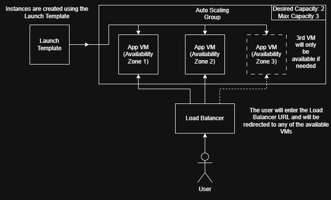

# Auto Scaling

## How to create an Auto Scaling Group on AWS

We are going to create an Auto Scaling Group for our Tic Tac Toe app.   
We want minimum 2 EC2 instances running at all times, and to be able to scale to 3 instances if needed.

1. Go to the [Auto Scaling Groups](https://eu-west-1.console.aws.amazon.com/ec2/home?region=eu-west-1#AutoScalingGroups:) page on AWS.
1. Click on "Create Auto Scaling group"
1. Choose a name for your Auto Scaling group and select your launch template, then click Next.  
(If you do not have a launch template, create one with your AMI)
1. Select all 3 availability zones, since we want max 3 instances running concurrently. Then click Next.
1. Choose "Attach to a new load balancer". We want an "Application Load Balancer" with the scheme being "Internet-facing".
1. You can add a "-lb" to the end of your Load Balancer name, so we know it is a load balancer for future reference.
1. Create a "target group" and you can add a "tg" to the end of the name. The target group is needed so our Load Balancer knows which VMs to direct traffic to.
1. Under "Health Checks", turn on "Elastic Load Balancing health checks". This is to be able to scale out if our VMs are unhealthy.
1. Change the "Health check grace period" to 90 seconds, as our instance should be running before 90 seconds. Click Next.
1. Change the "Desired capacity" to 2, the "Min desired capacity" to 2, and the "Max desired capacity" to 3.
1. Select "Target tracking scaling policy". This will allow us to have automatic scaling.
1. Change the "Instance warmup" to 90 seconds. Click Next.
1. You may add SNS topics for notifications, for this we will not. Click Next.
1. Add a tag with the Key "Name", and a Value to name your instances. Click Next.
1. Review the options and click "Create Auto Scaling group".
## Diagram on Auto Scaling



## What is a Load Balancer?
A Load Balancer is used to direct traffic between users and machines. If there are multiple machines running inside an Auto Scaling Group, the Load Balancer will redirect the user to an available machine.

## How to create a unhealthy instance for testing

To create an "unhealthy" instance we can SSH into the instance and use Apache Bench to load test or stress test it.  
We can send it thousands of requests concurrently till it reaches the threshold to become unhealthy, at which point our Auto Scaling Group will kick in and create a 3rd VM.

## How to SSH into an instance
To SSH into an instance you need you private key, the location of your private key on your machine and the public IP address of the machine you're trying to access.

The command is:
```
ssh -i <ENTER PATH TO KEY HERE> ubuntu@<ENTER IP ADDRESS HERE>
```

Example:
```
ssh -i ~/.ssh/key_name.pem ubuntu@127.0.0.1
```
## How to delete an Auto Scaling Group and other services

Before we delete the Auto Scaling Group, let's first delete the other services:
* Load Balancer Target Group
    1. Go to your Load Balancer Target Group, if you cannot find it click [here](https://eu-west-1.console.aws.amazon.com/ec2/home?region=eu-west-1#TargetGroups:)
    2. Click on "Actions" and click "Delete"
    3. Click "Delete".
* Load Balancer
    1. Go to your Load Balancer page, if you cannot find it click [here](https://eu-west-1.console.aws.amazon.com/ec2/home?region=eu-west-1#LoadBalancers:)
    2. Click on "Actions" and click "Delete load balancer".
    3. Type "confirm" and click "Delete".

Now let's delete the Auto Scaling Group.

1. Go to the Auto Scaling Groups page or if you cannot find it click [here](https://eu-west-1.console.aws.amazon.com/ec2/home?region=eu-west-1#AutoScalingGroups:)
1. Click on your Auto Scaling Group and make sure the tick box is checked.
1. Click on "Actions" and click "Delete".
1. Ensure you are deleting YOUR Auto Scaling Group, then enter "delete" and click "Delete".


