# Learning Splunk with Udemy <!-- omit in toc -->
I will be documenting everything I learn from the Udemy course "Splunk: Zero to Power User".
I'll only be writing about topics I don't know about, I might already know certain concepts or areas from my other SOC and Splunk md file.

Table of Contents:
- [Module 2: What Makes Up Splunk](#module-2-what-makes-up-splunk)
- [Module 3C: Demo of Getting the Practice Data](#module-3c-demo-of-getting-the-practice-data)
  - [Add-ons](#add-ons)
  - [Uploading tutorial files](#uploading-tutorial-files)
  - [Searching](#searching)
- [Module 4A: Getting Data into Splunk](#module-4a-getting-data-into-splunk)
- [Module 4B: Demo of Data Preview and Creating Inputs](#module-4b-demo-of-data-preview-and-creating-inputs)
  - [Monitoring](#monitoring)
- [Module 4C: App vs Addon](#module-4c-app-vs-addon)
- [Module 5: Demo of Searching and Basic Navigation](#module-5-demo-of-searching-and-basic-navigation)
- [Module 6A: Knowledge Objects](#module-6a-knowledge-objects)
- [Module 6B: Demo of KOs](#module-6b-demo-of-kos)
  - [Creating an Alert KO](#creating-an-alert-ko)
  - [Creating an Event Type](#creating-an-event-type)
- [Module 7: Show me the Fields!](#module-7-show-me-the-fields)
- [Module 8A: Search Processing Language](#module-8a-search-processing-language)
- [Module 8B: Demo of Building SPLs and Basic Commands](#module-8b-demo-of-building-spls-and-basic-commands)
  - [Keyboard shortcuts:](#keyboard-shortcuts)
  - [Example Searches:](#example-searches)
- [Module 9A: Transforming Your Search](#module-9a-transforming-your-search)
- [Module 9B: Transforming Commands](#module-9b-transforming-commands)
  - [Formatting](#formatting)
- [Module 10A: What are the Events Telling Me?](#module-10a-what-are-the-events-telling-me)
- [Module 10B: Demo of the Transaction Command](#module-10b-demo-of-the-transaction-command)
- [Module 11A: Manipulating Your Data](#module-11a-manipulating-your-data)
- [Module 11B: Demo of eval, where, and search](#module-11b-demo-of-eval-where-and-search)

## Module 2: What Makes Up Splunk

There are 3 kinds of Forwarders, a universal forwarder, a heavy forwarders, or an intermediary forwarder.

Searching by time in Splunk is the most efficient delimiter to set since it tells the indexer exactly where to pull the data from the disc.

You can merge roles with Search Heads, Indexers and Forwarders.

You need 3 search heads for it to be considered a search head cluster.

## Module 3C: Demo of Getting the Practice Data

### Add-ons
Once you're on Splunk within the docker container:
1. Create a Splunk account online if you haven't got one already
2. Click Find More Apps on the left  
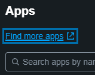  
3. Find an addon called Splunk Add-on for Cisco WSA  
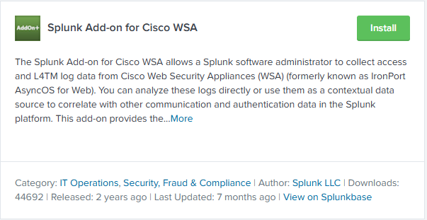  
4. Then find an addon for Splunk Add-on for Unix and Linux  
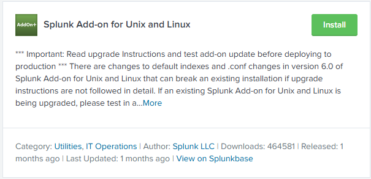  

### Uploading tutorial files
1. Click on Settings then click Add Data  
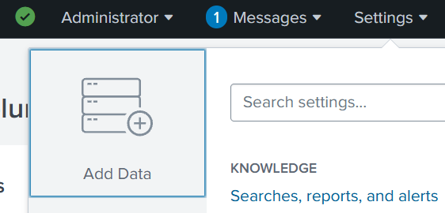

1. Click Upload  
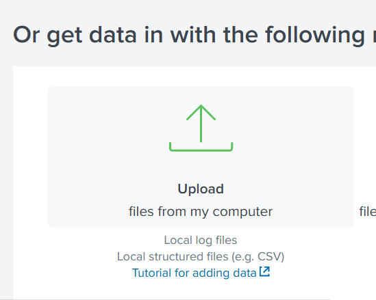

1. Click Select File and choose the access log from www1. Then click Next  
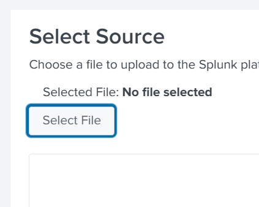

1. Change the source type to "access_combined"  
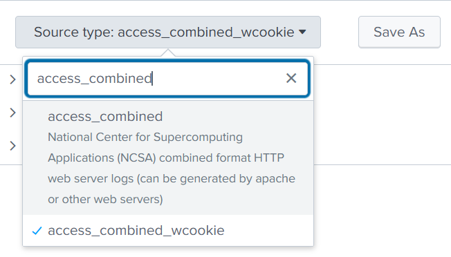

1. Click next  
2. For the host field value, enter "web1"  
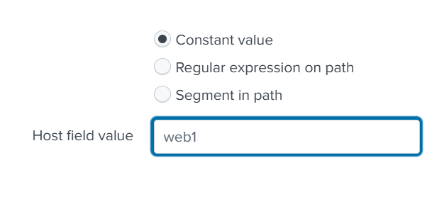

1. Create a new index and name it "web"  
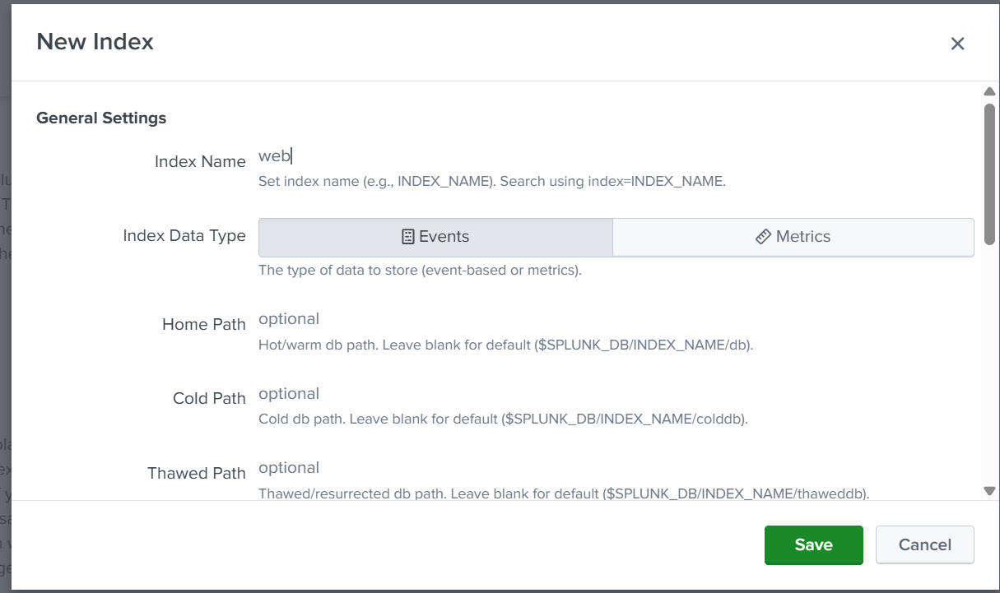

1. Click Review  
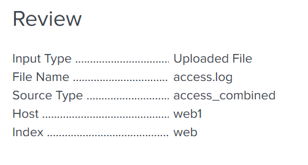  
If your page looks like the above screenshot, click submit  

1. To upload the second file click Add More Data  
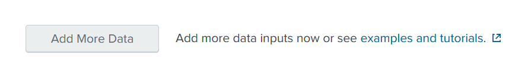

1.  Follow steps 2 and 3 again, but this time, select the secure.log file in the ww1 folder. Then click Next
2.  Select the source type as "linux_secure"  
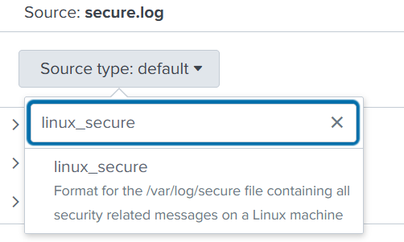

1.  Click next
2.  Enter the host as "web1" like in step 6
3.  Create a new index and name it "security"  
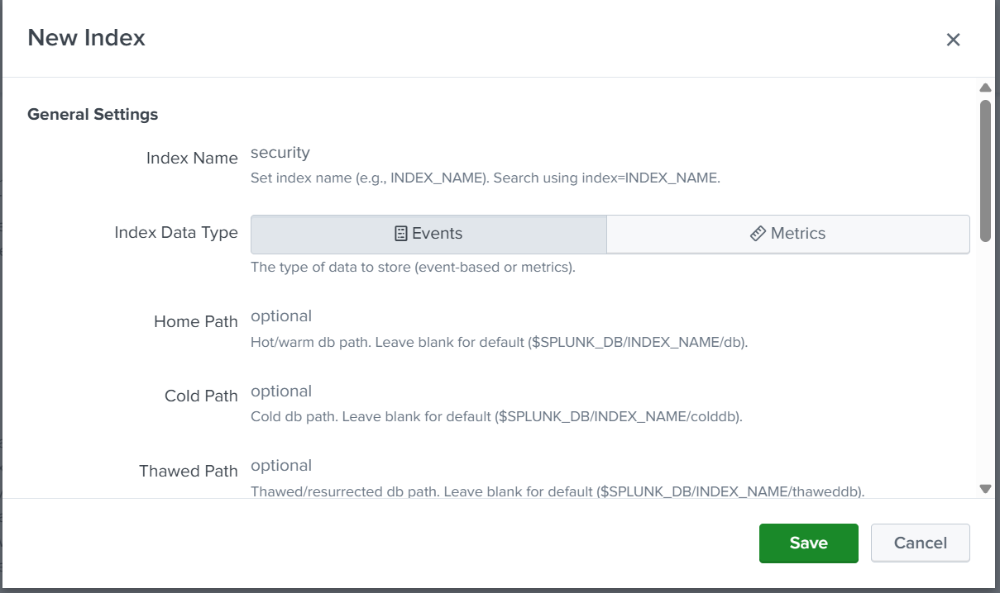

1. Click on Review  
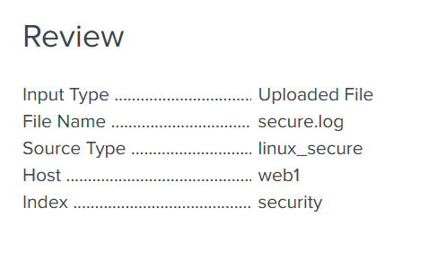  
If your page looks like the above screenshot, click Submit

Now, using the steps above do the same for the access logs and security logs in the folders: www2 & www3.   
Make sure the access logs have the source type as "access_combined" and the security logs as "linux_combined. 
For the ww2 files, enter the host name as "web2". For the ww3 files, enter "web3".  
Do **not** create new indexes. Instead use the ones you already created. For the access logs, use web. For the security logs, use security.

Now upload the cisco_ironport_web.log file:
1. Choose "cisco:wsa:squid" as the Source Type  
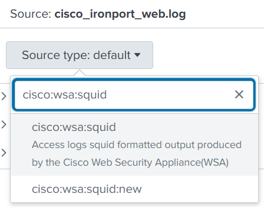

1. Enter "cisco" in the Host field value
2. Create a new index called "cisco"  
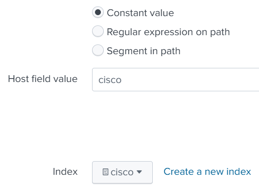

1. After clicking Review, this is what your page should look like:  
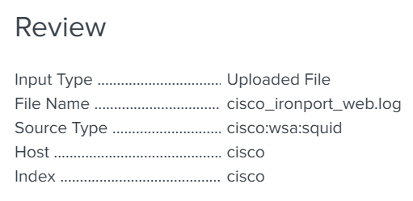

1. Click Submit

After submitting the practice data click on Apps and go to Search & Reporting  
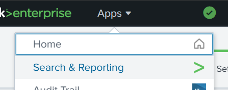

### Searching 
If you enter "index=*", you'll get an output of everything that has been done.  
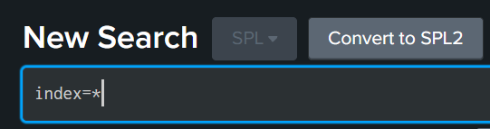  

Change the time range to all time  
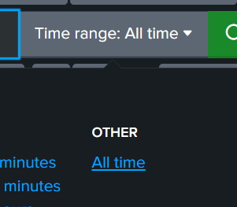

Once completed, scroll down till you find "index" in the list of fields on the left  
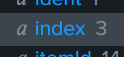  
There should be a 3 next to the field, because we've created 3 indexes. Click on the "index" field and you should see:  
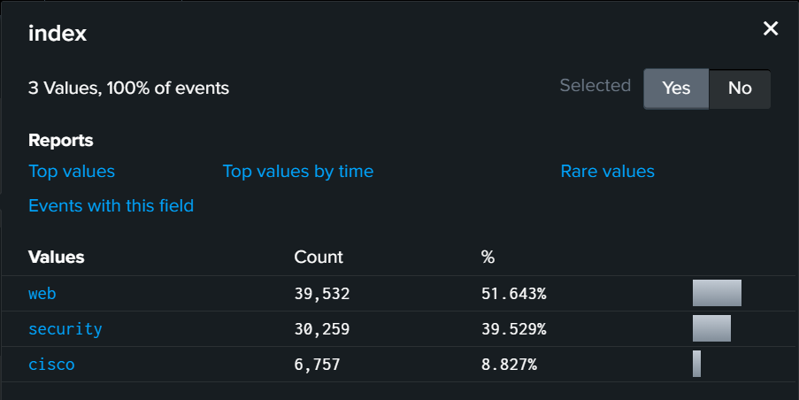

If you click "Yes" next to selected:  
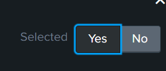  
It will show all the selected fields at the top corresponding to these indexes.  
We can see the 4 hosts, 3 indexes, and 3 source types that we used for uploading all the practice data.


## Module 4A: Getting Data into Splunk

Data Pipeline

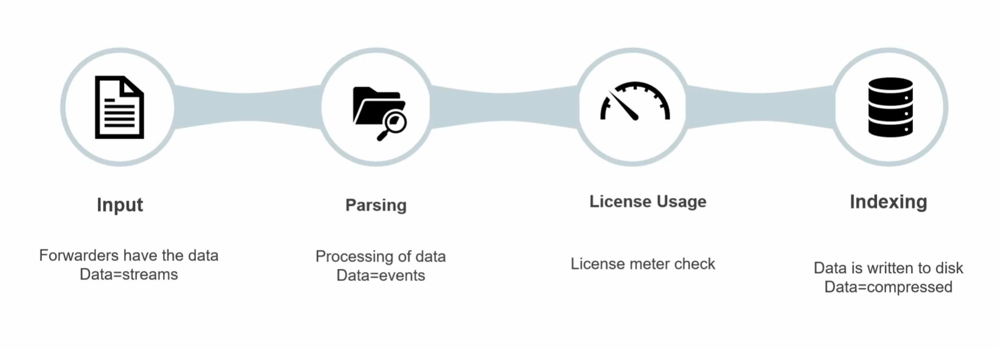

In the Input phase, we can:
* Upload data
* Monitor data
* Use a forwarder to forward it 
* Use HTTP event collector
* Use local log
* Network traffice
* Utilise ports to collect data

Metadata:
* Source - Path of the data
* Host - Who sent the data
* Sourcetype - How data is formatted (depending on what the sourcetype is, it will determine how the data is displayed)

## Module 4B: Demo of Data Preview and Creating Inputs

The Source Type will format the data depending on what you choose. If you have a CSV file, Splunk should automatically choose CSV as the Source Type, and display it correctly.

### Monitoring

1. Go to settings and click Add Data
2. Click on Monitor  
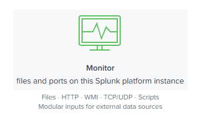
3. Click Local Event Logs
4. Choose some event logs like Application, Security, System
5. Enter "mybox" as Host
6. Create a new index called "SSA" (Security System Application)
7. Review and Submit

I wasn't able to do this since I using docker on a container.
Add another data to monitor
1. Choose Local Windows host monitoring
2. Enter collection name as "my_local_logs"
3. Select all event types
4. Enter 30 seconds as the Interval
5. Enter "mybox" as Host
6. Create a new index called "my_computer_logs"
7. Review and Submit

To search for what we chose to monitor, enter in the search bar `index="SSA" OR index="my_computers_logs"`

We can review our monitoring by going to Settings > Data Inputs. You're able to edit, delete, add data monitoring from there.

## Module 4C: App vs Addon
Apps:
* An App is something you can launch into
* Will have a GUI component
* Apps are usually going to reside on the Searchn Head

Add-ons:
* Add-ons are something that you can add to Splunk for functionality purposes
* No GUI
* More of a component that executes a script
* Usually vendor specific for the type of data involved
* AddOns will be on Indexers or Search Heads

Apps and Add-ons can both be visibily displayed in your App's menu.

There can be an App and AddOns for the same vendor. For example, there's an App for CrowdStrike and there are AddOns for their Intel Indicator or for Falcon Event Streams features

## Module 5: Demo of Searching and Basic Navigation

Under the Search & Reporting app you can find these functions:
* Search
* Analytics
* Datasets
* Reports
* Alerts
* Dashboards
* Modules  

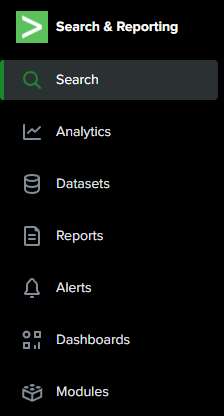

Under Search, you can find your Search History.  
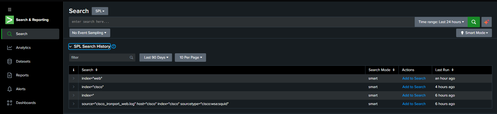

We also have Time Picker  
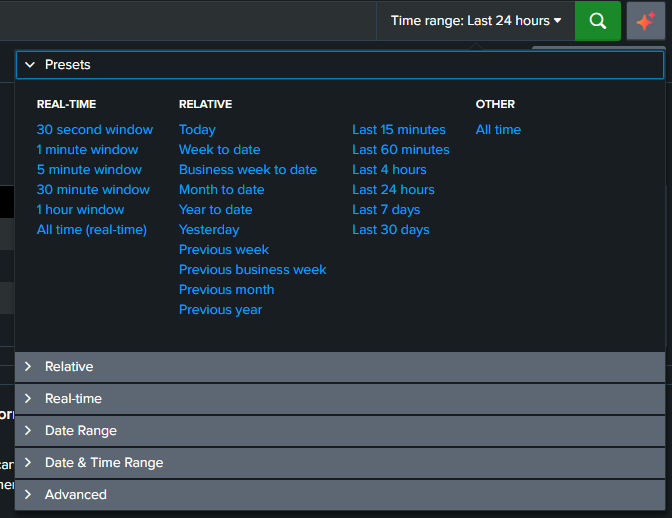  
When searching we can choose many different filters such as between date ranges, time ranges, specific time stamps, certain weeks or months, etc.

We also have 3 types of search modes.  
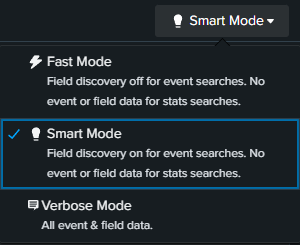
* Fast mode will show you less fields within an event because it will pull less data from the disc.
* Verbose mode will show the most information within an event because it will pull all the data from the disc.
* Smart mode either run verbose or fast mode depending on the type of search. If a transform search is run, Splunk will use Fast mode, if there are no transform commands, it will be in Verbose mode.

We can also save our Searches as different objects like a report.   
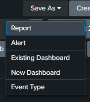

We can use the timeline to change the time picker to choose a certain range, we're also able to zoom out to get a wider view or zoom in on a selection.  
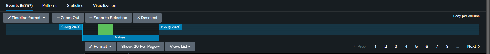

We can highlight a string from an event, then either add it to the search, exclude from the search, or create a new search.  
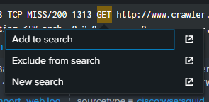

Can do the usual operators in searches. E.g:
``` 
AND # Needs to exist in both
OR  # Needs to exist in either
=   # Equal to
!=  # Not equal to
>   # Greater than
>=  # Greater than and equal to
<   # Less than
<=  # Less than and equal to
```

When searching you can use wildcards, for example:  
`index=security fail*`  
This will search for anything that says "fail" + anything after, like "failed" or "failure".
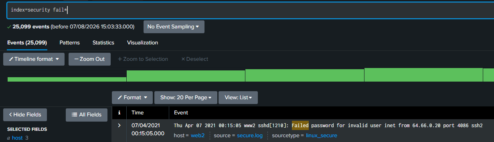

## Module 6A: Knowledge Objects

Anything you create that is reusable is a knowledge object (KO). E.g. Saved searches (reports), Alerts, tags, dashboards
KOs are managed by a Knowledge Manager. This role will be the person who oversees the object creations and ensures good performance.
Person who provides centralised oversight and maintenance of KOs for a Splunk Environment.

KO Naming Convention = ```<Group name>_<Type>_<Description>```
E.g. ```SOC_Alert_LoginFailures``

## Module 6B: Demo of KOs

To check if you have any KOs, you can click on settings and choose any of the options.  
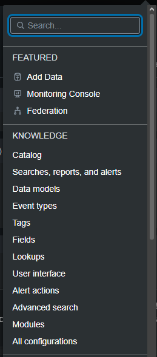  
For example, you can click on Searches, reports and alerts to see if you have any saved searches or alert KOs.

### Creating an Alert KO

We will create an Alert and show how you can add more filters to a search with Searching.

1. Go to Search & Reporting  
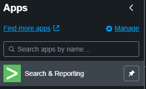  
1. For this we will try to find something in the security index to find an alert for. Enter ```index=security```

2. We can see a couple of failures, so we can filter for that and look for that as our alert.  
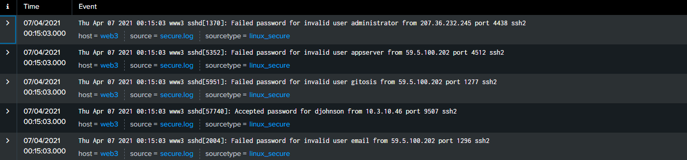  
To do this we can either click on action on the left and select failure, or we can click on the event itself and find the action failure and click add to search.  
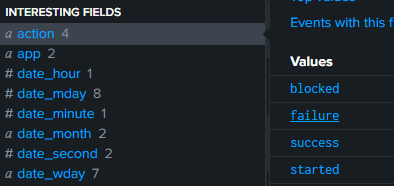  
OR
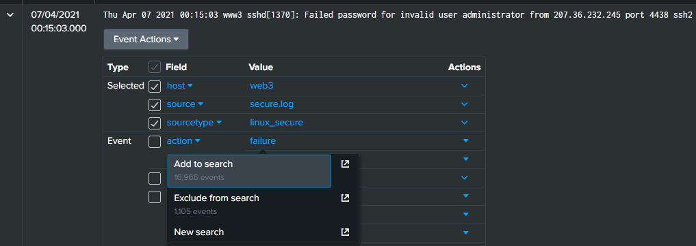  
Once you've clicked on it, it should add it to your serach.  
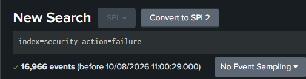  
1. Next, let's choose a single web server (host) to search on. So we can select web1 and add it to our search.  
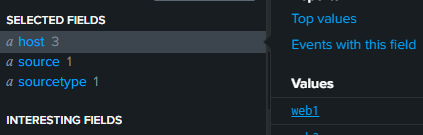  
1. Next let's add to our search the event type, sshd_authentication, to show a failed login.  
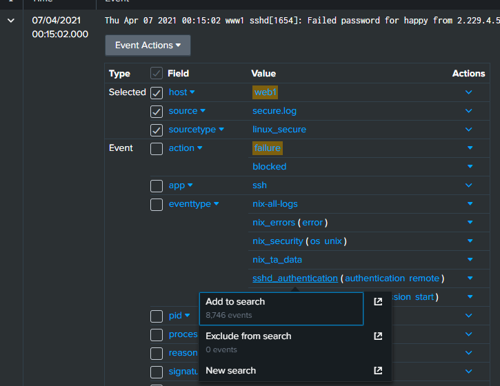
1. To make it more specific we can also filter on a user, admin.  
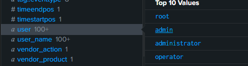  
1. We can also choose to filter for a specific IP, if we know one is a bad actor. For this example, we can choose the top IP.  
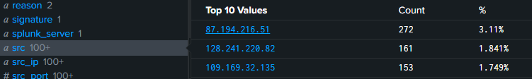  
1. This is what our search should now look like.  
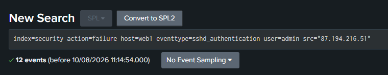  
1. We can now save this as an alert by clicking Save As > Alert  
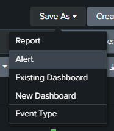  
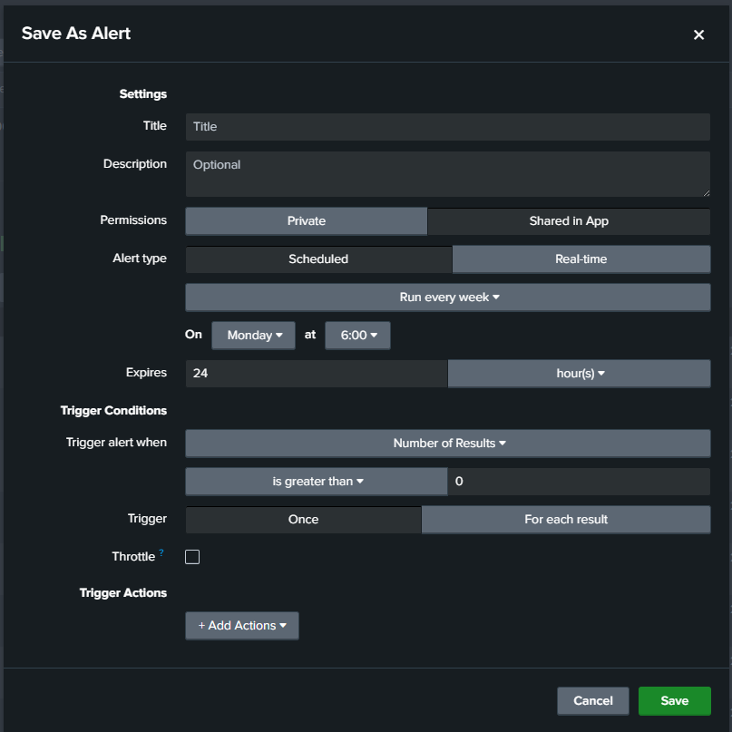  
1. We can give the alert a name and a description. We should use the standard naming convention for alerts: ```SOC_Alert_ExcessiveFailedLogins```   
And a small description explaining the alert.  
1. We can choose to share this alert with everyone on the App if we choose Shared in App  
2. We can schedule the alert to run on a certain timed basis or in real-time.  
3. Next are the trigger conditions, we'll choose to find a number of results, and that should be greater than 0, since we want to know if any logins have failed from this specific IP.  
4. We can choose to throttle the alert if e.g. there are 200 failed logins within 2 minutes, we'd get 200 alerts. Instead we can choose to throttle those alerts and supress triggering for every 60 seconds, so instead we'll get 2 alerts in those 2 minutes.  
This is what it should look like currently.  
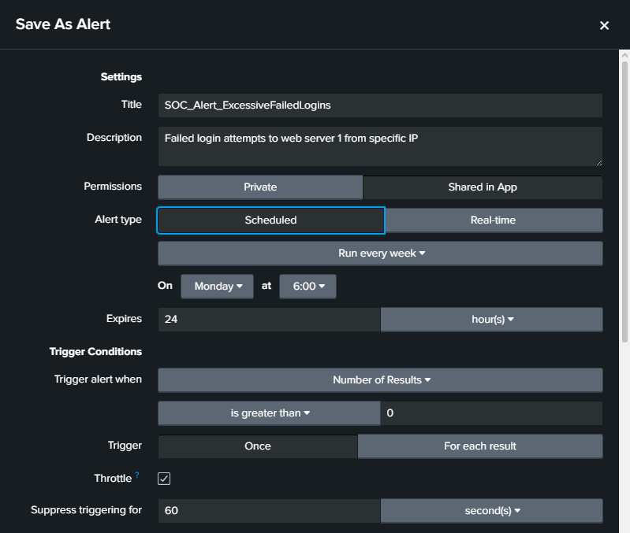  
1.  We want to log these alerts, to do this we can add a trigger action.  
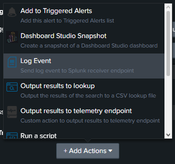  
1. Enter an event for the event log like "excessive failed logins from specific IP".   
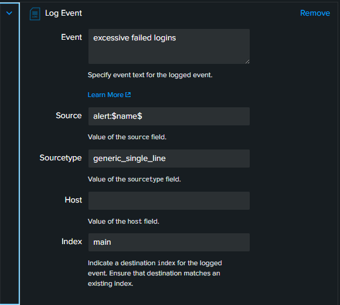  
1. We can also send use a trigger action to automatically send an email to ourselves if this alert gets triggered.  
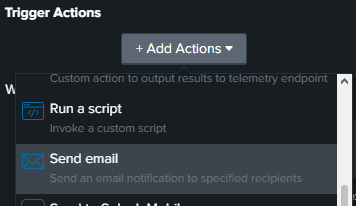  
1. Enter your email in the "To" box  
  
1. Click Save  
2. After creating the alert we can edit the Permissions with the pop-up.  
  
1. Here we can allow only user admins to write, but everyone else can read.   
  
1. Click Save  

Now the alert has been created, we can look for it like we did in the previous section, by clicking Settings > Searches, reports and alerts.  
  
From here you can edit, run, enable or disable the alert.

### Creating an Event Type

We will create an Event Type that looks for purchases made on the web store. 

1. Click on Settings > Event types  
  
1. Click New Event Type  
  
1. Change the Destination App to "search"  
2. Enter a name for the Event Type like "Purchases Made on Webstore"  
3. We want to look for purchases made on the web store, so we can search in the web index for a purchase action using ```index=web action=purchase```  
  
1. Click Save  

The Event Type should be created. To find your Event Type, filter for your Event Types by changing the owner to admin  
  
  
Here we can edit the permissions by clicking "Permissions".  
Then we can set the event type to appear in all apps, with everyone being able to read and only the admin being able to write.  
  
Once completed, click Save.

Now we can find our new Event Type under any events in the "web" index with the "purchase" action.


## Module 7: Show me the Fields!

Fields are data in events in the form of key value pairs (```field_name = field_value```).  
Field names are case sensitive, but field values are not.  
If no operators are set, Splunk assumes you're using AND (E.g. ```index=web host=web1``` Splunk sees this as ```index=web AND host=web1```).  


On the sidebar there are Selected Fields and Interesting Fields. You can move fields into the Selected Fields category by clicking "Yes" if you select a field from the sidebar as shown below.  
   
OR while looking at an event you can click the checkbox as shown below.  
  

Next to the fields on the sidebar, the "a" means the field value is alphanumeric (letters + numbers) and the "#" means the field value will only be numerical.  

You can select a field from the sidebar and create reports with a single click. You can choose Top values, Top values by time, Rare values and Events with this field. These reports will also show visual graphs.  
  

```!=``` is not ```NOT```  

```categoryID!=SPORTS``` will tell Splunk to search for everything that doesn't contain the field value ```SPORTS```.  
```NOT``` will tell Splunk to search for everything that doesn't contain the field value ```SPORTS``` AND all events where the ```categoryID``` field doesn't exist.  

To simplify:  
If you want to search for events that have ```categoryID``` as a field but not include ```SPORTS``` as a field value, then use ```!=```.  
If you want to search for events that have and doesn't have ```categoryID``` as a field value but not include ```SPORTS``` as a field value, then use ```NOT```.

## Module 8A: Search Processing Language

Orange: Command Modifiers ```OR, NOT, AND, as, by```  
Blue = The Commands ```Stats, Table, Rename, Dedup, Sort, Timechart```  
Green = The Arguments ```Limit, Span```  
Purple = The Functions ```Tostring, Sum, Values, Min, Max, Avg```  

Commands:  
* Table - Creates a table based off the variables and arguments set in the search
* Rename - Renames fields. Can be fields which currently exist in the data, or fields you've calculated and built in your searches
* Fields - Allows you to call on fields you want to include or exclude from your search
* Dedupe - De-duplicate. Removes duplicated values from the results
* Sort - Sorts your results 

## Module 8B: Demo of Building SPLs and Basic Commands


### Keyboard shortcuts:  
New Line - ```Shift + Enter```  
Auto format search - ```Ctrl + \```  
Expand search - ```Ctrl + Shift + E```

You can change your preferences on Splunk by going to Account name > Preferences.  
  

### Example Searches:
Show the total number of bytes in the web and security indexes under the name "Total_Bytes".  
  

We can make this more readable by adding an eval command.  


Limiting CategoryId to top 6 categories where purchases have been made  
  

Showing total purchases within the top 6 categories  
  

Table showing all actions, with the ip, categoryId and status  
  

Updated table with new names for the fields, removed any null actions and removed status


Showing total number of events using specific IPs  
  

## Module 9A: Transforming Your Search

A transforming command is a search command that orders the result into a data table.  
Transforming commands transform the specified cell value for each event into numerical values that Splunk can use for statistical purposes.  
If you're running Splunk in smart mode, using a transform command, it use fast mode search.

3 types of transform commands:
* Top
  * Finds the top common values of a field in a table
  * Top 10 results by default
  * Can be used with arguments
* Rare
  * Finds the least common values of a field in a table
  * Opposite of top
* Stats
  * Calculate statistics
  * Functions: count, dc, sum, avg, list, values, etc.

## Module 9B: Transforming Commands

If you have null values, you can use ```fillnull value="N/A"```. Now N/A will be displayed in every null value.

Top:  


Note! You can use Chart to visual your data in different types of graphs:   
  

Shows top 20 IPs that had failures


You can use ```showperc=f``` to remove the percentages  
  

Rare:  
  

  

Only show how many categories (dc means distinct):  
  

Show only category names:  
  
Another way, with alphabetical order:   


Number of actions per domain:  


Total amount of login attempts per IP, showing usernames:  
  

### Formatting

Can format your stats/tables with colours by clicking the paintbrush next to the field names.  
  

Using this you can also change number formatting.  
  

## Module 10A: What are the Events Telling Me?

Events can be grouped into transactions based on the associated and related identified fields of interest.  
If a relationship exists between the fields, then a transaction command can help enumerate that relation.  
Transaction commands are very taxing on your environment. When possible, use stats instead.
Stats will be faster, more efficient, and won't be as demanding of your resource.  
Use transaction when you are looking for something specific, or when you are looking for correlations, when you want to see the beginnings and endings of something grouped together.  
Use stats when you want to do calculations or group events.   
Example arguments:
* maxspan
  * Max time between all related events
  * Can be used to determine time between first and last event, showing the entire transaction length.
* maxpause
  * Sets max time between each event
  * Default is 1 minute
* startswith & endswith
  * Can set variables for keywords, Windows Event IDs, etc.
  * For example, you can set startswith as a WindowsEventID for a login, and endswith as a WindowsEventID for a log off.

## Module 10B: Demo of the Transaction Command

This search will generate a table which displays the ip and duration transactions for failed logins. It will only show transaction which at max happened within 3 minutes, and only a max time of 3 seconds between events.  
  

By doing this, we can dive deep through these transactions and find if there are any problems.

We can create a transaction command that can find each action a person did and how long the entire transaction was. We made the maxspan 10 minutes and maxpause 3 seconds between events
  
We can also use ```endswith=purchase``` to see each person that ends the transaction with buying something.

## Module 11A: Manipulating Your Data

Eval command writes to a new or existing field. If a field already exists, eval will overwrite it, but it does not modify the underlying data. We are only evaluating and manipulating our fields that have already been written to disc to display the results we want.

With eval command, you can covert epoch time to human readable datetime format.  
You can also run if statements.

Where and search can both filter your results.  
Where is similar to eval and uses boolean operators to search the results, and only keeps results that are true.
When the where command is used with double quotes, it will search for field values, if used with single quotes it will search for field names.  
You want to use the where command to compare two fields or match a condition. It's also common to use with the fillnull command.

Search command is used to look for keywords and uses wildcards. You can use it anywhere in the search, unlike where, which cannot be used before the first pipe.

## Module 11B: Demo of eval, where, and search

By using eval, I created a new field called epoch_time, which takes the ```_time``` value and returns the epoch time. They're in a table to show the difference.  

  