# Learning Splunk with Udemy <!-- omit in toc -->
I will be documenting everything I learn from the Udemy course "Splunk: Zero to Power User".
I'll only be writing about topics I don't know about, I might already know certain concepts or areas from my other SOC and Splunk md file.

Table of Contents:
- [Module 2: What Makes Up Splunk](#module-2-what-makes-up-splunk)
- [Module 3C: Demo of Getting the Practice Data](#module-3c-demo-of-getting-the-practice-data)
  - [Add-ons](#add-ons)
  - [Uploading tutorial files](#uploading-tutorial-files)
  - [Searching](#searching)
- [Module 4A: Getting Data into Splunk](#module-4a-getting-data-into-splunk)
- [Module 4B: Demo of Data Preview and Creating Inputs](#module-4b-demo-of-data-preview-and-creating-inputs)
  - [Monitoring](#monitoring)
- [Module 4C: App vs Addon](#module-4c-app-vs-addon)
- [Module 5: Demo of Searching and Basic Navigation](#module-5-demo-of-searching-and-basic-navigation)
- [Module 6A: Knowledge Objects](#module-6a-knowledge-objects)
- [Module 6B: Demo of KOs](#module-6b-demo-of-kos)
  - [Creating an Alert KO](#creating-an-alert-ko)
  - [Creating an Event Type](#creating-an-event-type)
- [Module 7: Show me the Fields!](#module-7-show-me-the-fields)
- [Module 8A: Search Processing Language](#module-8a-search-processing-language)
- [Module 8B: Demo of Building SPLs and Basic Commands](#module-8b-demo-of-building-spls-and-basic-commands)
  - [Keyboard shortcuts:](#keyboard-shortcuts)
  - [Example Searches:](#example-searches)
- [Module 9A: Transforming Your Search](#module-9a-transforming-your-search)
- [Module 9B: Transforming Commands](#module-9b-transforming-commands)
  - [Formatting](#formatting)
- [Module 10A: What are the Events Telling Me?](#module-10a-what-are-the-events-telling-me)
- [Module 10B: Demo of the Transaction Command](#module-10b-demo-of-the-transaction-command)
- [Module 11A: Manipulating Your Data](#module-11a-manipulating-your-data)
- [Module 11B: Demo of eval, where, and search](#module-11b-demo-of-eval-where-and-search)
- [Module 12B: Demo of Field Extracting](#module-12b-demo-of-field-extracting)
- [Module 13A: Lookups](#module-13a-lookups)
- [Module 13B: Demo of Using Lookups](#module-13b-demo-of-using-lookups)
- [Module 14A: Visualize Your Data](#module-14a-visualize-your-data)
- [Module 14B: Demo of Chart, Chart, Chart.....stats.](#module-14b-demo-of-chart-chart-chartstats)
- [Module 15A: Visualizations, Part 2!](#module-15a-visualizations-part-2)
- [Module 15B: Demo of More Dashboards!](#module-15b-demo-of-more-dashboards)
- [Module 16A: Reports \& Drilldowns](#module-16a-reports--drilldowns)
- [Module 16B: Demo of Generating Reports, Drilldowns, Home Dashboard](#module-16b-demo-of-generating-reports-drilldowns-home-dashboard)
- [Module 17: Alerts](#module-17-alerts)
- [Module 18: Welcome, Tags and Events!](#module-18-welcome-tags-and-events)
- [Module 19A: Macros](#module-19a-macros)
- [Module 19B: Demo of Making Macros](#module-19b-demo-of-making-macros)
- [Module 20: Workflows to Save You Time](#module-20-workflows-to-save-you-time)
- [Module 21A: Data Normalization \& Troubleshooting](#module-21a-data-normalization--troubleshooting)
- [Module 21B: Demo of All the random things we just covered](#module-21b-demo-of-all-the-random-things-we-just-covered)
- [Module 22A: Datamodels](#module-22a-datamodels)
- [Module 22A: Datamodels](#module-22a-datamodels-1)
- [Module 23A: The Common Information Model](#module-23a-the-common-information-model)
- [Module 23B: Demo of the CIM Add-on \& CIM Add-On Builder](#module-23b-demo-of-the-cim-add-on--cim-add-on-builder)

## Module 2: What Makes Up Splunk

There are 3 kinds of Forwarders, a universal forwarder, a heavy forwarders, or an intermediary forwarder.

Searching by time in Splunk is the most efficient delimiter to set since it tells the indexer exactly where to pull the data from the disc.

You can merge roles with Search Heads, Indexers and Forwarders.

You need 3 search heads for it to be considered a search head cluster.

## Module 3C: Demo of Getting the Practice Data

### Add-ons
Once you're on Splunk within the docker container:
1. Create a Splunk account online if you haven't got one already
2. Click Find More Apps on the left  
  
3. Find an addon called Splunk Add-on for Cisco WSA  
  
4. Then find an addon for Splunk Add-on for Unix and Linux  
  

### Uploading tutorial files
1. Click on Settings then click Add Data  


1. Click Upload  


1. Click Select File and choose the access log from www1. Then click Next  


1. Change the source type to "access_combined"  


1. Click next  
2. For the host field value, enter "web1"  


1. Create a new index and name it "web"  


1. Click Review  
  
If your page looks like the above screenshot, click submit  

1. To upload the second file click Add More Data  


1.  Follow steps 2 and 3 again, but this time, select the secure.log file in the ww1 folder. Then click Next
2.  Select the source type as "linux_secure"  


1.  Click next
2.  Enter the host as "web1" like in step 6
3.  Create a new index and name it "security"  


1. Click on Review  
  
If your page looks like the above screenshot, click Submit

Now, using the steps above do the same for the access logs and security logs in the folders: www2 & www3.   
Make sure the access logs have the source type as "access_combined" and the security logs as "linux_combined. 
For the ww2 files, enter the host name as "web2". For the ww3 files, enter "web3".  
Do **not** create new indexes. Instead use the ones you already created. For the access logs, use web. For the security logs, use security.

Now upload the cisco_ironport_web.log file:
1. Choose "cisco:wsa:squid" as the Source Type  


1. Enter "cisco" in the Host field value
2. Create a new index called "cisco"  


1. After clicking Review, this is what your page should look like:  


1. Click Submit

After submitting the practice data click on Apps and go to Search & Reporting  


### Searching 
If you enter "index=*", you'll get an output of everything that has been done.  
  

Change the time range to all time  


Once completed, scroll down till you find "index" in the list of fields on the left  
  
There should be a 3 next to the field, because we've created 3 indexes. Click on the "index" field and you should see:  


If you click "Yes" next to selected:  
  
It will show all the selected fields at the top corresponding to these indexes.  
We can see the 4 hosts, 3 indexes, and 3 source types that we used for uploading all the practice data.


## Module 4A: Getting Data into Splunk

Data Pipeline


In the Input phase, we can:
* Upload data
* Monitor data
* Use a forwarder to forward it 
* Use HTTP event collector
* Use local log
* Network traffice
* Utilise ports to collect data

Metadata:
* Source - Path of the data
* Host - Who sent the data
* Sourcetype - How data is formatted (depending on what the sourcetype is, it will determine how the data is displayed)

## Module 4B: Demo of Data Preview and Creating Inputs

The Source Type will format the data depending on what you choose. If you have a CSV file, Splunk should automatically choose CSV as the Source Type, and display it correctly.

### Monitoring

1. Go to settings and click Add Data
2. Click on Monitor  

3. Click Local Event Logs
4. Choose some event logs like Application, Security, System
5. Enter "mybox" as Host
6. Create a new index called "SSA" (Security System Application)
7. Review and Submit

I wasn't able to do this since I using docker on a container.
Add another data to monitor
1. Choose Local Windows host monitoring
2. Enter collection name as "my_local_logs"
3. Select all event types
4. Enter 30 seconds as the Interval
5. Enter "mybox" as Host
6. Create a new index called "my_computer_logs"
7. Review and Submit

To search for what we chose to monitor, enter in the search bar `index="SSA" OR index="my_computers_logs"`

We can review our monitoring by going to Settings > Data Inputs. You're able to edit, delete, add data monitoring from there.

## Module 4C: App vs Addon
Apps:
* An App is something you can launch into
* Will have a GUI component
* Apps are usually going to reside on the Searchn Head

Add-ons:
* Add-ons are something that you can add to Splunk for functionality purposes
* No GUI
* More of a component that executes a script
* Usually vendor specific for the type of data involved
* AddOns will be on Indexers or Search Heads

Apps and Add-ons can both be visibily displayed in your App's menu.

There can be an App and AddOns for the same vendor. For example, there's an App for CrowdStrike and there are AddOns for their Intel Indicator or for Falcon Event Streams features

## Module 5: Demo of Searching and Basic Navigation

Under the Search & Reporting app you can find these functions:
* Search
* Analytics
* Datasets
* Reports
* Alerts
* Dashboards
* Modules  


Under Search, you can find your Search History.  


We also have Time Picker  
  
When searching we can choose many different filters such as between date ranges, time ranges, specific time stamps, certain weeks or months, etc.

We also have 3 types of search modes.  

* Fast mode will show you less fields within an event because it will pull less data from the disc.
* Verbose mode will show the most information within an event because it will pull all the data from the disc.
* Smart mode either run verbose or fast mode depending on the type of search. If a transform search is run, Splunk will use Fast mode, if there are no transform commands, it will be in Verbose mode.

We can also save our Searches as different objects like a report.   


We can use the timeline to change the time picker to choose a certain range, we're also able to zoom out to get a wider view or zoom in on a selection.  


We can highlight a string from an event, then either add it to the search, exclude from the search, or create a new search.  


Can do the usual operators in searches. E.g:
``` 
AND # Needs to exist in both
OR  # Needs to exist in either
=   # Equal to
!=  # Not equal to
>   # Greater than
>=  # Greater than and equal to
<   # Less than
<=  # Less than and equal to
```

When searching you can use wildcards, for example:  
`index=security fail*`  
This will search for anything that says "fail" + anything after, like "failed" or "failure".


## Module 6A: Knowledge Objects

Anything you create that is reusable is a knowledge object (KO). E.g. Saved searches (reports), Alerts, tags, dashboards
KOs are managed by a Knowledge Manager. This role will be the person who oversees the object creations and ensures good performance.
Person who provides centralised oversight and maintenance of KOs for a Splunk Environment.

KO Naming Convention = ```<Group name>_<Type>_<Description>```
E.g. ```SOC_Alert_LoginFailures``

## Module 6B: Demo of KOs

To check if you have any KOs, you can click on settings and choose any of the options.  
  
For example, you can click on Searches, reports and alerts to see if you have any saved searches or alert KOs.

### Creating an Alert KO

We will create an Alert and show how you can add more filters to a search with Searching.

1. Go to Search & Reporting  
  
1. For this we will try to find something in the security index to find an alert for. Enter ```index=security```

2. We can see a couple of failures, so we can filter for that and look for that as our alert.  
  
To do this we can either click on action on the left and select failure, or we can click on the event itself and find the action failure and click add to search.  
  
OR
  
Once you've clicked on it, it should add it to your serach.  
  
1. Next, let's choose a single web server (host) to search on. So we can select web1 and add it to our search.  
  
1. Next let's add to our search the event type, sshd_authentication, to show a failed login.  

1. To make it more specific we can also filter on a user, admin.  
  
1. We can also choose to filter for a specific IP, if we know one is a bad actor. For this example, we can choose the top IP.  
  
1. This is what our search should now look like.  
  
1. We can now save this as an alert by clicking Save As > Alert  
  
  
1. We can give the alert a name and a description. We should use the standard naming convention for alerts: ```SOC_Alert_ExcessiveFailedLogins```   
And a small description explaining the alert.  
1. We can choose to share this alert with everyone on the App if we choose Shared in App  
2. We can schedule the alert to run on a certain timed basis or in real-time.  
3. Next are the trigger conditions, we'll choose to find a number of results, and that should be greater than 0, since we want to know if any logins have failed from this specific IP.  
4. We can choose to throttle the alert if e.g. there are 200 failed logins within 2 minutes, we'd get 200 alerts. Instead we can choose to throttle those alerts and supress triggering for every 60 seconds, so instead we'll get 2 alerts in those 2 minutes.  
This is what it should look like currently.  
  
1.  We want to log these alerts, to do this we can add a trigger action.  
  
1. Enter an event for the event log like "excessive failed logins from specific IP".   
  
1. We can also send use a trigger action to automatically send an email to ourselves if this alert gets triggered.  
  
1. Enter your email in the "To" box  
  
1. Click Save  
2. After creating the alert we can edit the Permissions with the pop-up.  
  
1. Here we can allow only user admins to write, but everyone else can read.   
  
1. Click Save  

Now the alert has been created, we can look for it like we did in the previous section, by clicking Settings > Searches, reports and alerts.  
  
From here you can edit, run, enable or disable the alert.

### Creating an Event Type

We will create an Event Type that looks for purchases made on the web store. 

1. Click on Settings > Event types  
  
1. Click New Event Type  
  
1. Change the Destination App to "search"  
2. Enter a name for the Event Type like "Purchases Made on Webstore"  
3. We want to look for purchases made on the web store, so we can search in the web index for a purchase action using ```index=web action=purchase```  
  
1. Click Save  

The Event Type should be created. To find your Event Type, filter for your Event Types by changing the owner to admin  
  
  
Here we can edit the permissions by clicking "Permissions".  
Then we can set the event type to appear in all apps, with everyone being able to read and only the admin being able to write.  
  
Once completed, click Save.

Now we can find our new Event Type under any events in the "web" index with the "purchase" action.


## Module 7: Show me the Fields!

Fields are data in events in the form of key value pairs (```field_name = field_value```).  
Field names are case sensitive, but field values are not.  
If no operators are set, Splunk assumes you're using AND (E.g. ```index=web host=web1``` Splunk sees this as ```index=web AND host=web1```).  


On the sidebar there are Selected Fields and Interesting Fields. You can move fields into the Selected Fields category by clicking "Yes" if you select a field from the sidebar as shown below.  
   
OR while looking at an event you can click the checkbox as shown below.  
  

Next to the fields on the sidebar, the "a" means the field value is alphanumeric (letters + numbers) and the "#" means the field value will only be numerical.  

You can select a field from the sidebar and create reports with a single click. You can choose Top values, Top values by time, Rare values and Events with this field. These reports will also show visual graphs.  
  

```!=``` is not ```NOT```  

```categoryID!=SPORTS``` will tell Splunk to search for everything that doesn't contain the field value ```SPORTS```.  
```NOT``` will tell Splunk to search for everything that doesn't contain the field value ```SPORTS``` AND all events where the ```categoryID``` field doesn't exist.  

To simplify:  
If you want to search for events that have ```categoryID``` as a field but not include ```SPORTS``` as a field value, then use ```!=```.  
If you want to search for events that have and doesn't have ```categoryID``` as a field value but not include ```SPORTS``` as a field value, then use ```NOT```.

## Module 8A: Search Processing Language

Orange: Command Modifiers ```OR, NOT, AND, as, by```  
Blue = The Commands ```Stats, Table, Rename, Dedup, Sort, Timechart```  
Green = The Arguments ```Limit, Span```  
Purple = The Functions ```Tostring, Sum, Values, Min, Max, Avg```  

Commands:  
* Table - Creates a table based off the variables and arguments set in the search
* Rename - Renames fields. Can be fields which currently exist in the data, or fields you've calculated and built in your searches
* Fields - Allows you to call on fields you want to include or exclude from your search
* Dedupe - De-duplicate. Removes duplicated values from the results
* Sort - Sorts your results 

## Module 8B: Demo of Building SPLs and Basic Commands


### Keyboard shortcuts:  
New Line - ```Shift + Enter```  
Auto format search - ```Ctrl + \```  
Expand search - ```Ctrl + Shift + E```

You can change your preferences on Splunk by going to Account name > Preferences.  
  

### Example Searches:
Show the total number of bytes in the web and security indexes under the name "Total_Bytes".  
  

We can make this more readable by adding an eval command.  


Limiting CategoryId to top 6 categories where purchases have been made  
  

Showing total purchases within the top 6 categories  
  

Table showing all actions, with the ip, categoryId and status  
  

Updated table with new names for the fields, removed any null actions and removed status


Showing total number of events using specific IPs  
  

## Module 9A: Transforming Your Search

A transforming command is a search command that orders the result into a data table.  
Transforming commands transform the specified cell value for each event into numerical values that Splunk can use for statistical purposes.  
If you're running Splunk in smart mode, using a transform command, it use fast mode search.

3 types of transform commands:
* Top
  * Finds the top common values of a field in a table
  * Top 10 results by default
  * Can be used with arguments
* Rare
  * Finds the least common values of a field in a table
  * Opposite of top
* Stats
  * Calculate statistics
  * Functions: count, dc, sum, avg, list, values, etc.

## Module 9B: Transforming Commands

If you have null values, you can use ```fillnull value="N/A"```. Now N/A will be displayed in every null value.

Top:  


Note! You can use Chart to visual your data in different types of graphs:   
  

Shows top 20 IPs that had failures


You can use ```showperc=f``` to remove the percentages  
  

Rare:  
  

  

Only show how many categories (dc means distinct):  
  

Show only category names:  
  
Another way, with alphabetical order:   


Number of actions per domain:  


Total amount of login attempts per IP, showing usernames:  
  

### Formatting

Can format your stats/tables with colours by clicking the paintbrush next to the field names.  
  

Using this you can also change number formatting.  
  

## Module 10A: What are the Events Telling Me?

Events can be grouped into transactions based on the associated and related identified fields of interest.  
If a relationship exists between the fields, then a transaction command can help enumerate that relation.  
Transaction commands are very taxing on your environment. When possible, use stats instead.
Stats will be faster, more efficient, and won't be as demanding of your resource.  
Use transaction when you are looking for something specific, or when you are looking for correlations, when you want to see the beginnings and endings of something grouped together.  
Use stats when you want to do calculations or group events.   
Example arguments:
* maxspan
  * Max time between all related events
  * Can be used to determine time between first and last event, showing the entire transaction length.
* maxpause
  * Sets max time between each event
  * Default is 1 minute
* startswith & endswith
  * Can set variables for keywords, Windows Event IDs, etc.
  * For example, you can set startswith as a WindowsEventID for a login, and endswith as a WindowsEventID for a log off.

## Module 10B: Demo of the Transaction Command

This search will generate a table which displays the ip and duration transactions for failed logins. It will only show transaction which at max happened within 3 minutes, and only a max time of 3 seconds between events.  
  

By doing this, we can dive deep through these transactions and find if there are any problems.

We can create a transaction command that can find each action a person did and how long the entire transaction was. We made the maxspan 10 minutes and maxpause 3 seconds between events
  
We can also use ```endswith=purchase``` to see each person that ends the transaction with buying something.

## Module 11A: Manipulating Your Data

Eval command writes to a new or existing field. If a field already exists, eval will overwrite it, but it does not modify the underlying data. We are only evaluating and manipulating our fields that have already been written to disc to display the results we want.

With eval command, you can covert epoch time to human readable datetime format.  
You can also run if statements.

Where and search can both filter your results.  
Where is similar to eval and uses boolean operators to search the results, and only keeps results that are true.
When the where command is used with double quotes, it will search for field values, if used with single quotes it will search for field names.  
You want to use the where command to compare two fields or match a condition. It's also common to use with the fillnull command.

Search command is used to look for keywords and uses wildcards. You can use it anywhere in the search, unlike where, which cannot be used before the first pipe.

## Module 11B: Demo of eval, where, and search

By using eval, I created a new field called epoch_time, which takes the ```_time``` value and returns the epoch time. They're in a table to show the difference.  

  

I also created a human readable time field.  
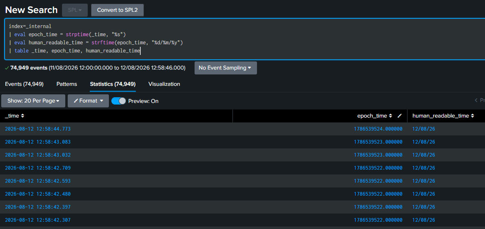

```strptime``` and ```strftime``` stands for String Parse Time and String Format Time.  
```strptime``` is used to parse text into epoch, computer readable time.  
```strptime``` is used to format the time into a human readable format.  

If we wanted to find a specific day of the year that an event was created on, we can do that by using this search:  
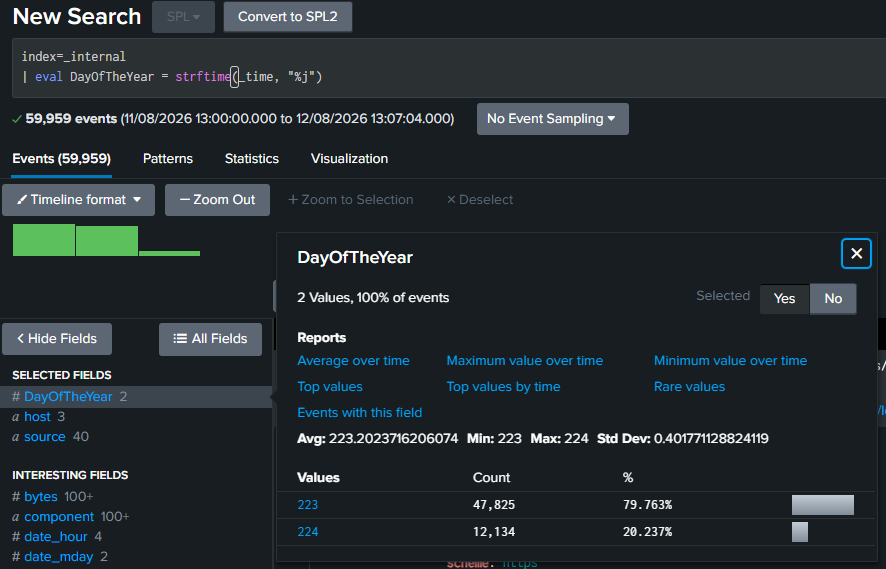  

Now if we add day 223 or 224 in our search field, we can see all the events on that specific day.  
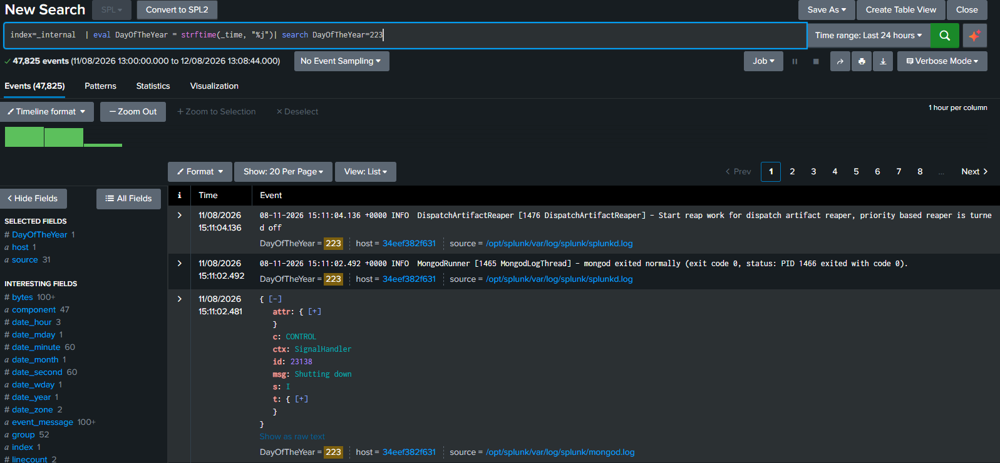  

We can fact check this with a simple google search.  
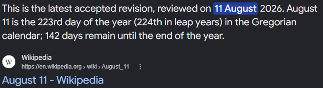

By using the case command, we can add new values for the field values (this will not overwrite or modify the data, we are simply putting a tag on it for readability), and make a list too. In the below example I used status codes and wrote the meaning of them instead.   
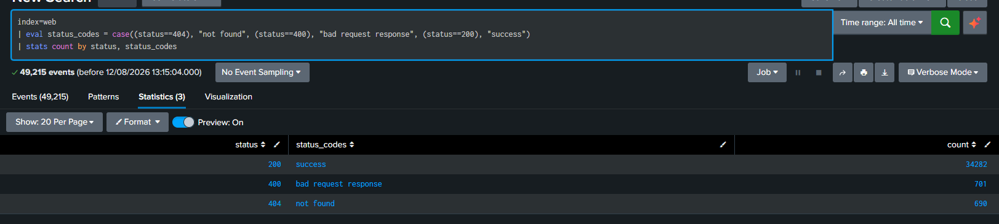  

We can use MD5 (Message Digest 5) which is an algorithm that turns any text or data into  a unique 32-character code called a hash.   
For Splunk, its used in search commands or data streams to anonymise sensitive data, create unique IDs, check file integrity, or match known malware signatures.  
Here's an example of creating unique IDs for filenames:  
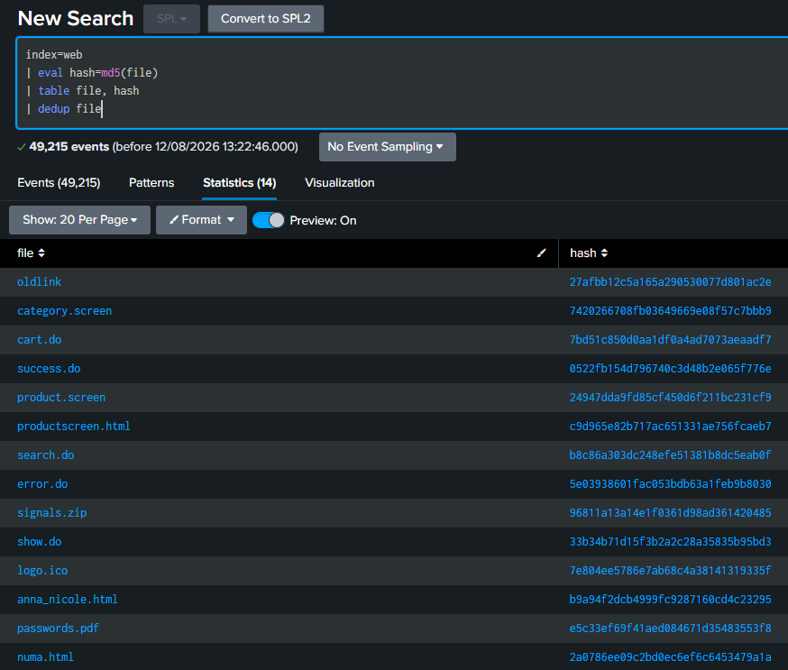  

Example of how to see data from a certain CIDR block:  
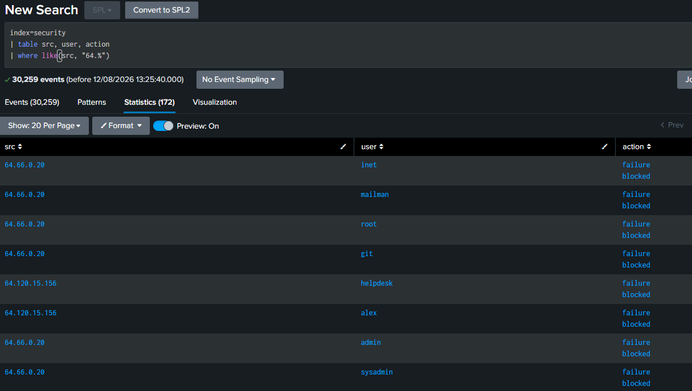

## Module 12B: Demo of Field Extracting

There are 3 ways to get to the Field Extractor:
1. Go to Settings > Fields > Field Extractions > Open Field Extractor  
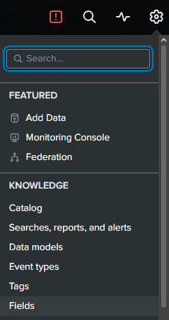  
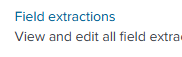  
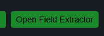  
2. When searching, at the bottom of the sidebar of events, click + Extract New Fields  
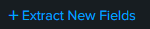  
3. When looking at an Event, click Event Actions > Extract Fields  
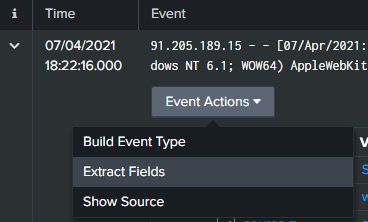  

To extract fields using Regular Expressions:  
1. After choosing an event, click Next, then choose Regular Expression  
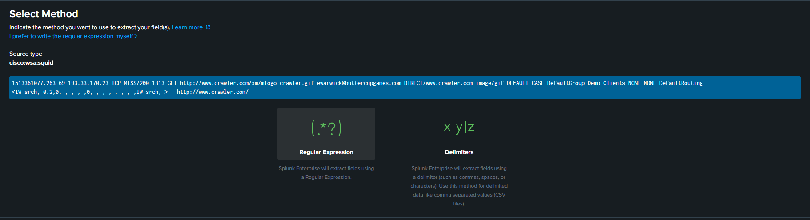  
2. Highlight a section of the event, enter a name and click Add Extraction  
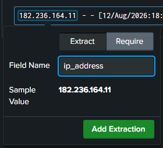  
3. At the bottom of the page you can see your field extraction working by seeing the results  
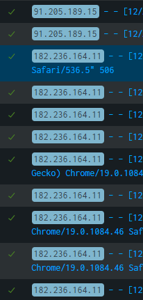  
4. Click Next, validate the extraction works as it should
5. Click Next, review the summary and set the permissions if needed, then click Finish

To use regex while searching you can use "rex":   
```rex field=_raw (?<field_name>"<regex_expression>")```  
field=_raw means it will search the entire event  

You can also use erex, which takes examples:
```erex <field_name> examples="enter","examples","here"```  
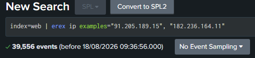  
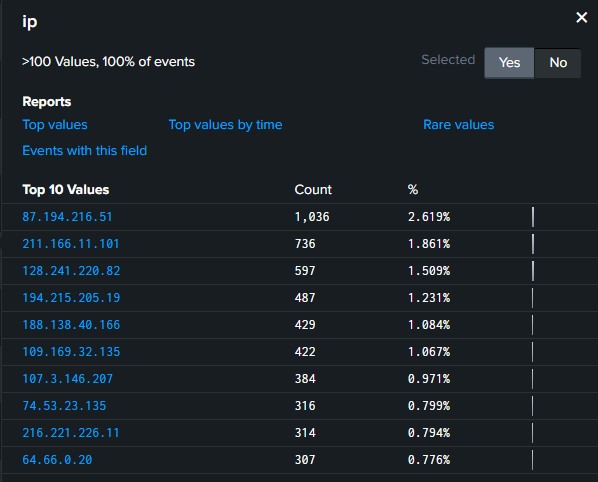  

## Module 13A: Lookups

A lookup file is a file that contains static data which is used to query in your searches  
Lookup files are not stored in the indexes  
Looksups are used as a tool, it can pull data from files during searches and can add additional fields for you to search on
To create a lookup table go to Settings > Lookups > Lookup table files > Click New Lookup Table File

## Module 13B: Demo of Using Lookups
To search for what is inside the lookup file you can use inputlookup:   
e.g. ```inputlookup peopleinfo.csv```

You can also use conditions:   
e.g. ```inputlookup peopleinfo.csv where (first_name=Henry)```

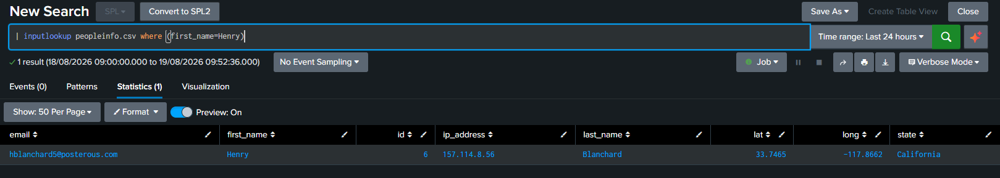  

To create a definition for a lookupfile to create new fields, go to Settings > Lookups > Lookup table definitions > Click New Lookup Definition.  

Next we will create a new csv file using search and export, then add it as a lookup table:

1. Search to get only productId and click Export as productinfo.csv(download button on the right)  
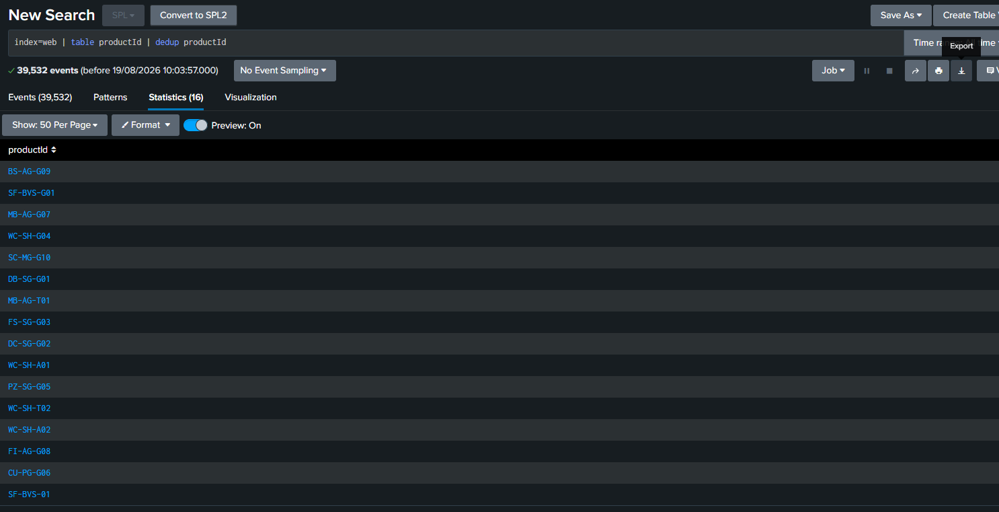  
2. Edit the new csv file and add a description for each item
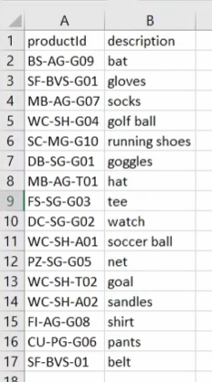  
3. Add it as a new lookup file. Settings > Lookups > +Add New
4. Now we can search using lookup and output to get more information:
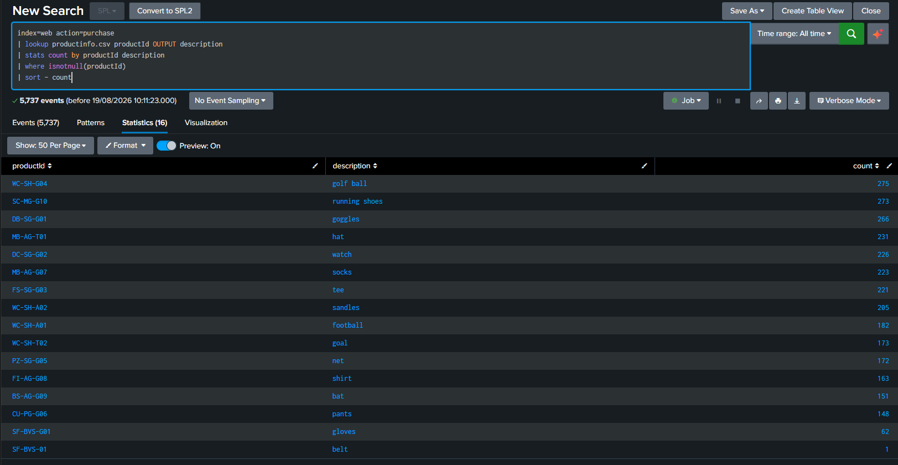  


## Module 14A: Visualize Your Data  
* timechart is used to display statistical trends over time  
* chart can generate summarised versions of a stats table  
* stats can easily alter any stats table  

Stacking allows you to stack values for each field on e.g. the same bar for a barchart  
Overlay allows you to increase your trend line analysis e.g. two line charts over each other on the same graph  
Trellis allows you to display multiple charts at once  
Multi-series determines if your fields are sharing your Y-axis or not
 
## Module 14B: Demo of Chart, Chart, Chart.....stats.

Example of a chart showing number of actions per day  
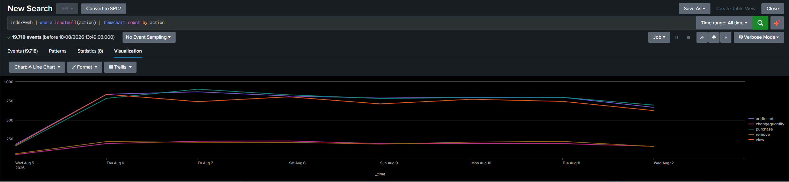  

Example of a stacked bar chart:
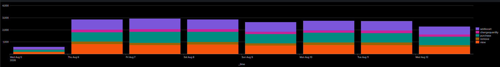

Example of adding Purchase action as an overlay. The purchase action is now a line in the bar chart.
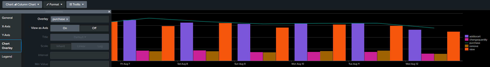

## Module 15A: Visualizations, Part 2!

* iplocation adds location info to your visualisations
* geostats is used to calculate functions to display locations on a clustermap
* addtotals adds multiple values together of a chart
* trendline overlays on a chart to show an average

## Module 15B: Demo of More Dashboards!

Once you've made a search, click Save As > New Dashboard or Existing Dashboard.

Example of using a trendline:  
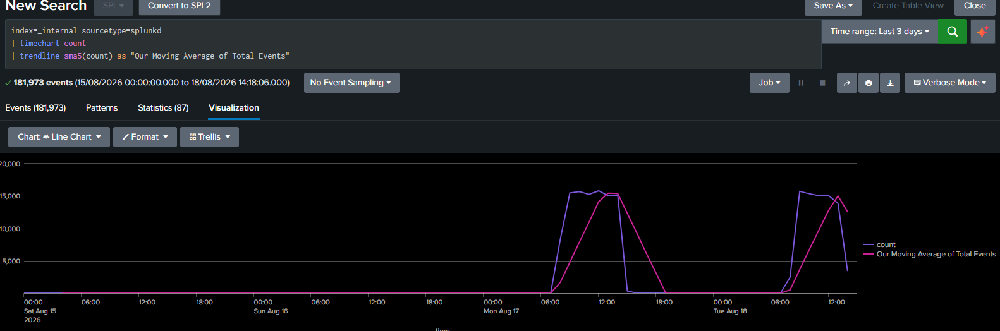  

Example of iplocation and geostats:  
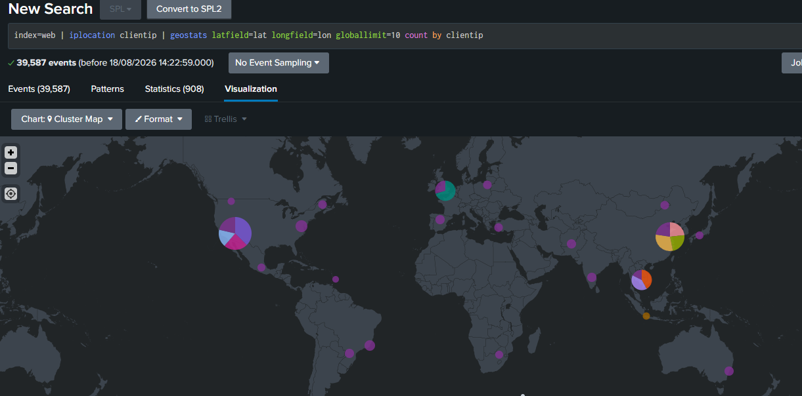  

Example of search to show which regions/country/cities purchased the most from the online store:  
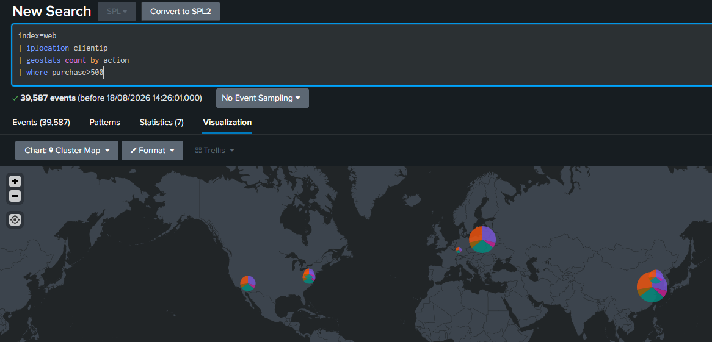  

## Module 16A: Reports & Drilldowns

* Reports are saved searches
* Reports can be set to run on a schedule
* Reports are knowledge objects that are shareable

Drilldowns allow you search further into a dashboard or reports. Tokens can be used to allow for user input, like variables. 
Dashboards can be exported as PDFs.

## Module 16B: Demo of Generating Reports, Drilldowns, Home Dashboard

Example of Drilldowns:

1. First let's create a search and a dashboard from that search:  
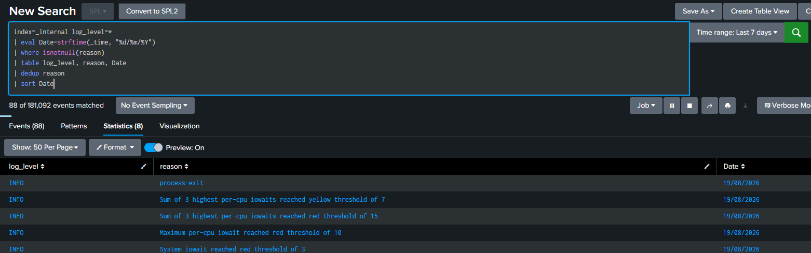  

2. Click Save As > New Dashboard and then name this as home dashboard with a suitable panel title.  
3. Click on Edit > +Add Input > Text, then do the same but for Submit  
4. Now click the pencil edit button and enter "loglevel" as the Label and Token  
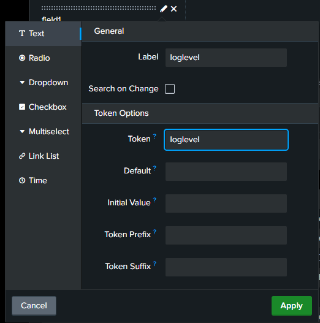  
5. Now lets edit the search string of the Dashboard by clicking the magnifying glass  
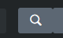  
6. Replace ```log_level=*``` with the token we just created ```$loglevel$```, then click Apply  
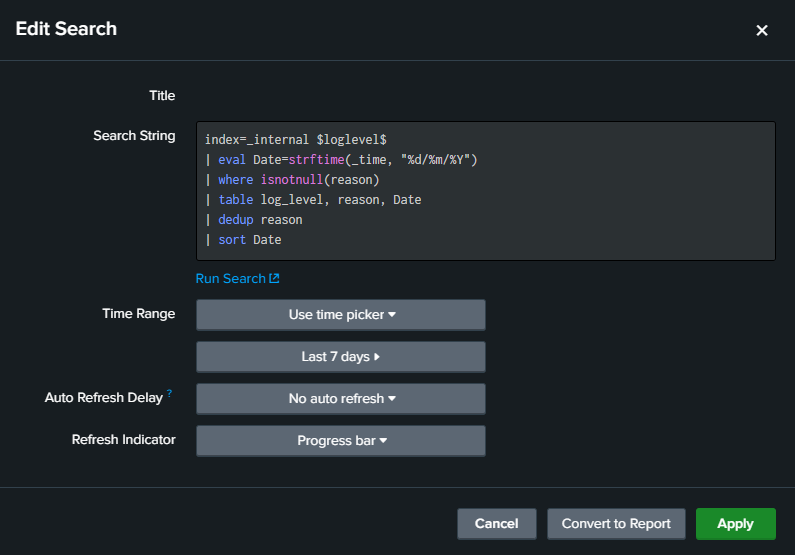  
1. Now we can enter "INFO", "WARN" or "ERROR" in the new text box and Submit to see only those specific logs  
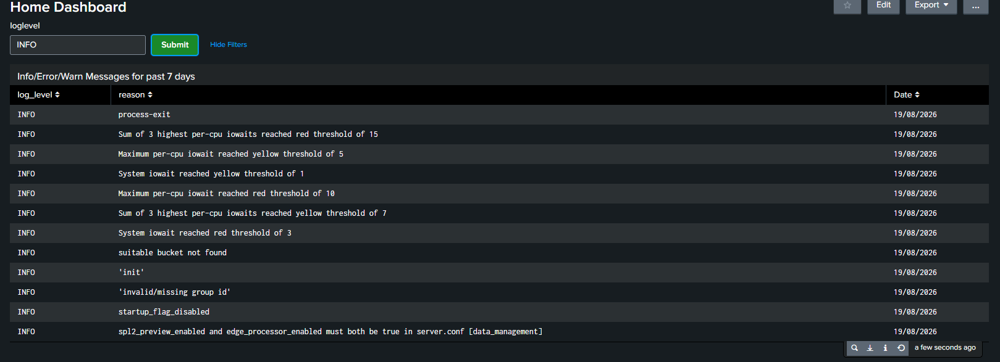  
1. Next we can add a time input  
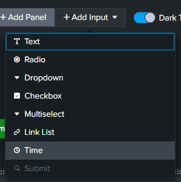  
1. As on the text input, edit the time input's Label and Token to "time", and for the Default choose "Last 7 days". Then click Apply  
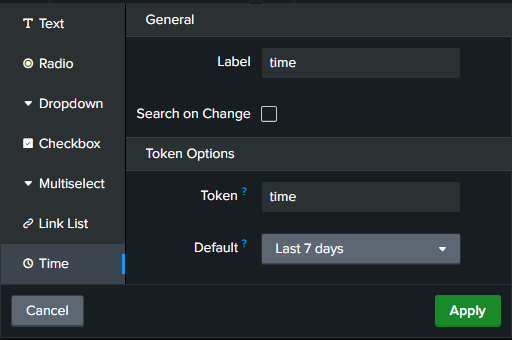  
1. Next edit the search again and change Time Range to Shared Time Picker (time)  
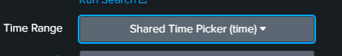  
1. Lastly, you can change the name of the panel while editing by clicking the name. Then click Save  

After creating a report, you can add a report to a dashboard. You can also schedule a report to run at certain times.

If you click the 3 dots on a panel in a dashboard you can click Edit Drilldown, from there you can link your results to a search to be able to investigate results easily
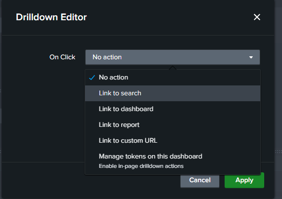  

The results then become blue, allowing you to click them to take you to a search  
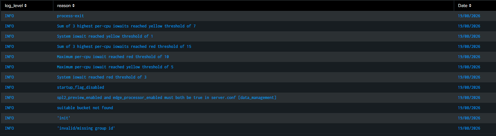  
Another way you can do this is by assigning your clicks to a token, then searching for what you have clicked on another panel:  
1. Edit the drilldown of the panel and change On Click to Manage tokens on this dashboard.  
2.  Set the token name as "userclick" and the token value as "$click.value2". This assigns the token to any field value you click on  
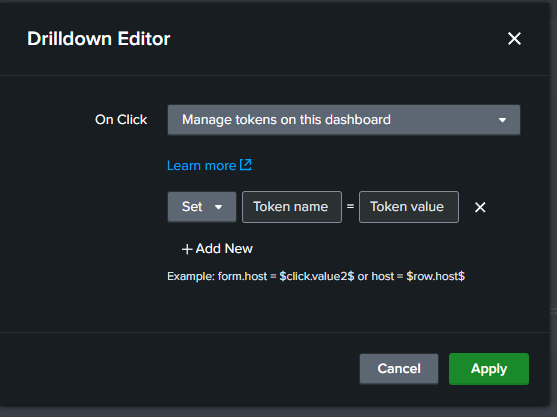  
1. Next click + Add Panel > New > Events
2. Set the Content Title as User Input
3. Set the search string as ```index=_internal $userclick$```
4. You can also set the time range to match the time input by setting the Time Range as Shared Time Picker (time)  
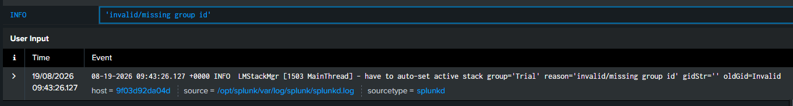  

You can export everything as a PDF too by clicking Export at the top right.  
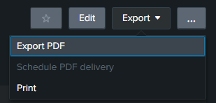  

You can set this as your home dashboard by going to Dashboards > Click Edit on the dashboard > Set as home dashboard

## Module 17: Alerts
Alerts are based on searches that is already set (similar to a report) which can be run on a schedule or in real-time.  
With alerts you can set trigger conditions and trigger actions.  
* Conditions: Alert will only trigger if criteria has been met
* Actions: Multiple different actions can be made once an alert has been triggered e.g. Email to notify an alert has been riggered, log events, send alerts to a lookup, etc.

You can throttle and supress the number of alerts so if 100 events happen at once where each event would trigger a single alert, we can throttle it so an alert can only be triggered once every 5 minutes.  

To create an alert, once you've created a search, click Save As > Alert.

In the Alert you can set the time to run on a Cron Schedule. You can use https://crontab.guru to create a Cron Schedule Expression.  

## Module 18: Welcome, Tags and Events!
Tags and Event types are both knowledge objects.  

You can use tags by tagging your events, these can serve as little reminders.  
They can be created for field value pairs.  
You can create more than oen tag per field combination.  
Tags are case sensitive.  

To create a tag, in an event click the Actions button on a field, then click Edit Tags
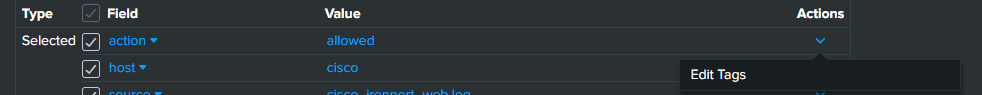  
For an example, if I create a tag for a status=200, I can name the tag "success".   
Then we can search for tag=success which will show every 200 response code event.  
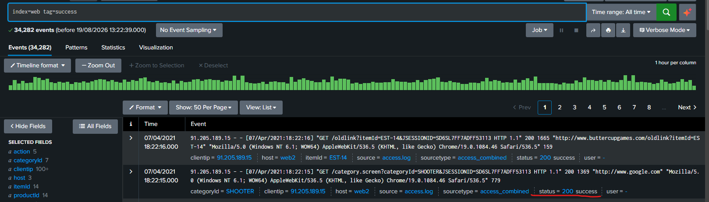  

To see all your created tags, go to Settings > Tags, from here you can choose any option depending on what you're looking for.  
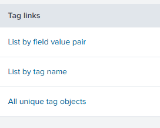  
All will lead to your tags. They are just different ways for searching for them.  

Event Types are created to share knowledge with peers through highlighting and colour coding events.  
E.g. Colour all status code 200 logs as Green and all 404s as Red. 
It's a good way to categorise your data.  

Lets create an event type to make every status 200 event green:  
1. Search for index=web status=200  
2. Click on an event and click Event Actions > Build Event Type  
3. No need to edit or test anything here so click Save, enter the name Status 200 Events  
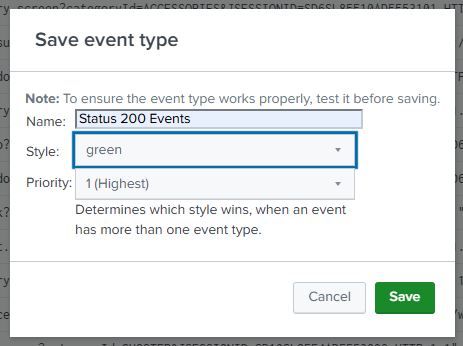  
Now our events are highlighted as green  
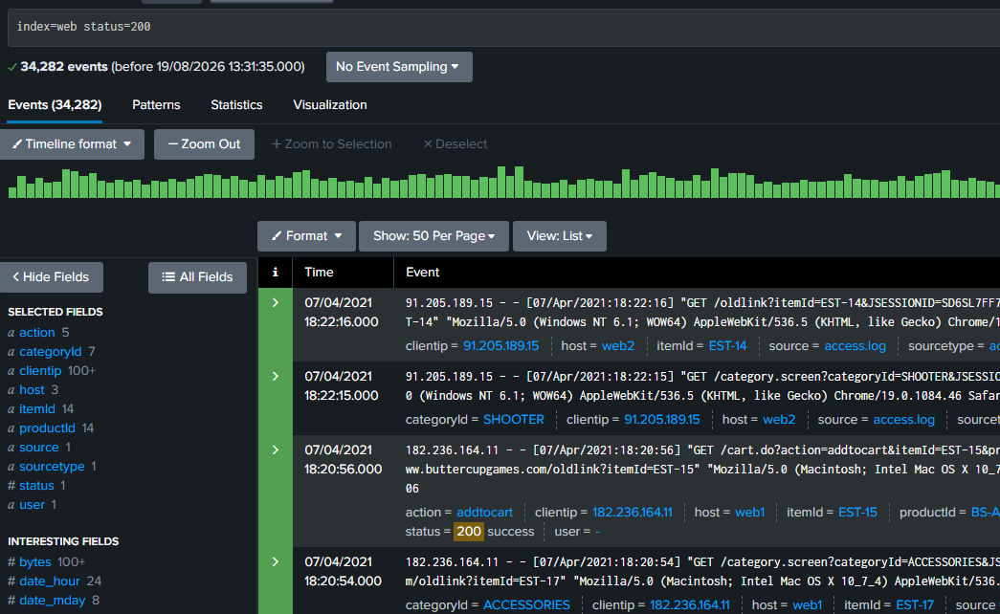  

## Module 19A: Macros
Macros are shortcuts to use in your searches.  
They're really useful for searches if you have a long query which you have to run multiple times a day.  
If you have a macro in your search you can use Ctrl + Shift + E to expand the macro to see the search.  
To run a macro, surround its name with back ticks.  
To create a macro go to Settings > Advanced Search > Add New

## Module 19B: Demo of Making Macros

Creating a new macro:

1. Go to Settings > Advanced Search > Add New
2. Enter Name as salesmade
3. In the definition enter:
```
index=web action=purchase 
| stats count by host 
| addtotals col=true row=false fieldname="Total" labelfield=host count
```
4. Click Save

Now if we search salesmade with backticks around it:  
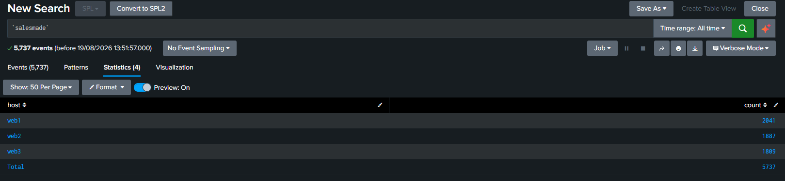  

If we need an argument in the search we can surround the field value with $ e.g. ```action=$input$```.  
Then in the arguments section when adding a macro, you can enter ```input```.  
If you're using an argument, the macro name must include the number of arguments e.g. ```salesmade(2)``` for 2 arguments used  
To use the macro, just write the input inside the brackets like in coding  

## Module 20: Workflows to Save You Time

3 types of Workflow Actions:
* Push - GET
  * Creates HTML links to interact with sites
* Pull - POST
  * Generates a HTTP POST request to a specified URI
* Search 
  * Launch secordary searches using field values 

To create a Workflow Action: Settings > Fields > Workflow Actions

Example of a GET Workflow Action to get an IP address' information:

1. Go to Settings > Fields > Workflow Actions > Add New  
2. Enter a name like "IP whois lookup"  
3. Enter a label ```whois:$clientip$```  
4. Enter "clientip" in Apply only to the following fields  
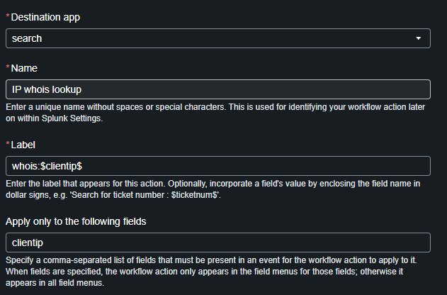  
1. Make sure the Action Type is "link" and enter ```https://whois.domaintools.com/$clientip$``` in the URI text box  
  
To test this works, go to an event with a field "clientip" and click Event Actions, then click "whois:", and a new window should open showing the information of the IP.

## Module 21A: Data Normalization & Troubleshooting

Field aliases are a way to normalise your data.  
Can apply multiple fields to the same field alias.  
When we make a field alias, the original field name will still appear if it's more than 20% of your results.  
To create a Field Alias go to Settings > Fields > Field Aliases > Click New Field Alias

A calculated field is a field you can make using the eval command which will perform some maths.
To create a Calculated Field go to Settings > Fields > Calculated Field > Click New Calculated Field


Hot bucket:
* The only bucket that is writeable
* Indexer will write data based off of time and trhe events with the most recent time is written into hot buckets

Warm bucket & Cold bucket:
* When a Hot bucket becomes old it turns into a warm bucket, and a warm bucket turns into a cold bucket
* Warm and cold buckets cannot be written to, but all buckets can be searched 

Frozen bucket:
* Frozen bucket has long-term storage, for something like compliance requirements
* Not searchable

Thawed bucket: 
* If you want to search a Frozen bucket, you'd have to make it a Thawed bucket, so it would become searchable

Job Inspector:
* Has detailed information about how your search performed
* Allows you to troubleshoot your search efficiency or reason for failing
* Provides information abbout how the search completed, and time it took to run
* If you're using a KO wrong, it will suggest how to correct your search

## Module 21B: Demo of All the random things we just covered

Normalising IPs from all indexes to only show under a single field name "source_ip":

Settings > Field > Field Alias > Add New

1. Enter the sourcetype for web events, with the field name used for IPs. Then click Save
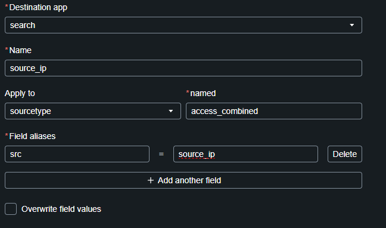  

2.  Create another Field Alias and enter the sourcetype of cisco events with the field name used for IPs. Then click Save  
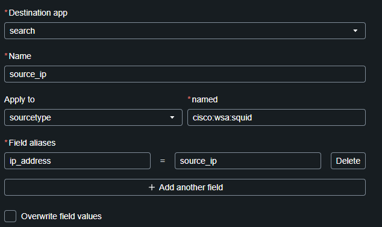  
3. Lastly, do the same for the linux_secure events

To check this worked, we can search all indexes with "source_ip": ```index=* source_ip=*```  
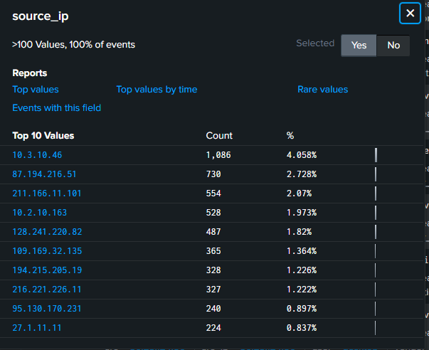  


Creating a calculated field to show megabytes instead of bytes:  
Settings > Fields > Field Aliases > Add New  
1. Enter megs as the Name  
2. Enter access_combined as the sourcetype  
3. Enter ```bytes/1024/1024``` as the Eval expression
4. Click Save  
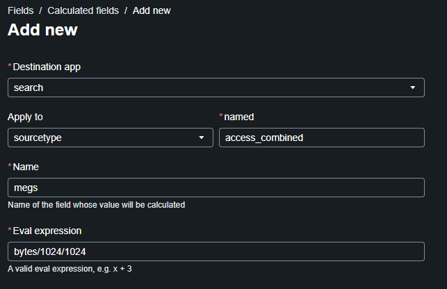  

We can now use this in a search:  
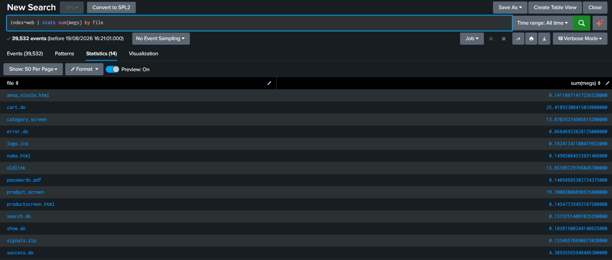   


We can use ```dbinspect index=*``` to search for our buckets:  
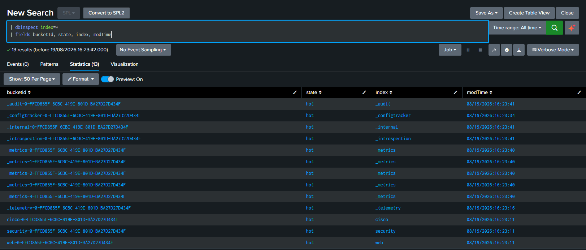  

## Module 22A: Datamodels
A datamodel is essentially a model to associate specific data types to.  
Each datamodel is heirarchical and has a parent and child relationship.  

Datamodels are composed of datasets, which can be arranged in a hierarchical structure of parent and child datasets. Each child dataset represents a subset of the dataset covered by its parent dataset.


## Module 22A: Datamodels

To view our datamodels: Settings > Data models

A datamodel can be accelerated to speed up interactions. If it has a yellow lightning bolt, that means it's accelerated. If you want to accelerate a dataset you can click Edit > Edit Acceleration. You can set a summary range to only accelerate a specific range of data.

On a datamodel you can Pivot it to see all the events generated in the data model. You can create visualisations and searches in the pivots too.

Below is an example of the parent and child heirarchy:  
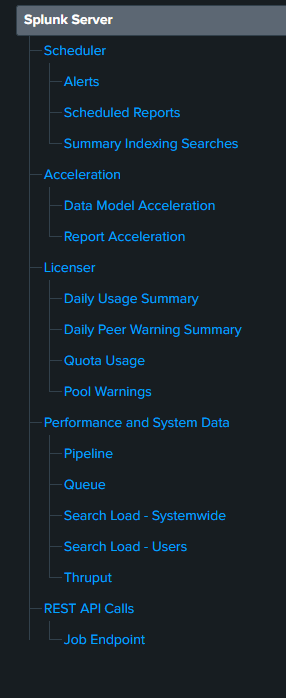  

You can use tstats in SPL similar to stats, but it will search within the Datamodel instead.  
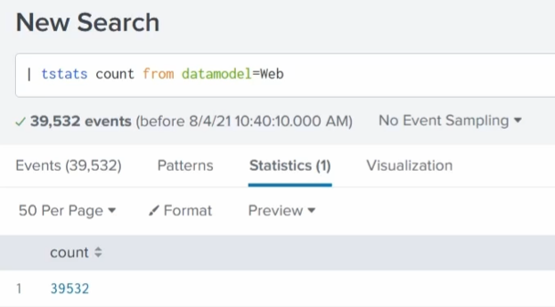  

You can use the "datamodel" command to search within a datamodel too:  
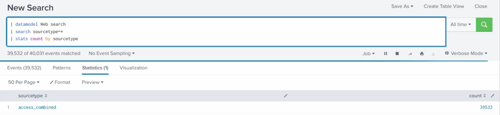  

To search inside a specific dataset in datamodel you can write the names of the datasets after the name of the datamodel, e.g.: ```| datamodel internal_server server scheduler | search *```(these are the names of the datasets of the example hierarchy above)

## Module 23A: The Common Information Model

The CIM is a model used to reference a common model to map their data to.   
It's also an application, it provides 22 pre-configured data models for you to use and then build off, tune, and map your data to.  
The CIM allows all data coming from applications used in your enviroment can be searched.  
Before we used field aliases, we had all different field names for IP addresses. If we were to leverage CIM and map all of our practice data to the models, then we would be mapping the same field name to all the IP addresses.  
The CIM offers assistance when creating field extractions, field aliases, tags, etc.  
This allows for easier and more efficient correlation of data that's coming from all different source types.

With Splunk Enterprise Security, all the data that goes into it needs to be CIM compliant in order for it to be used.  
ES relies heavily on data models for searching and operating.  
You can also use the CIM if you want all your users at a workplace to be searching the data in a similar way, e.g. for training.  
It can also be used as an audit tool to see how much of your data is CIM compliant.  

The official Splunk Documentation also tells us everything about the CIM datamodels.

## Module 23B: Demo of the CIM Add-on & CIM Add-On Builder

To download the CIM app:
1. Go to Home > Find more apps:
1. Search CIM
2. Install the Splunk Common Information Model (CIM)   
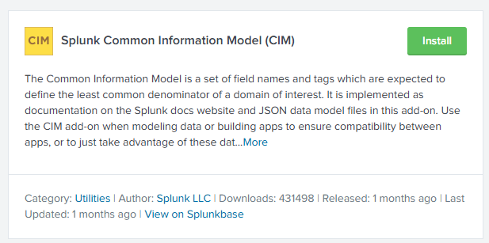  

We can now see all the datamodels the CIM app has given us by going to Settings > Datamodels.

We can see what data is mapped to our Web data model:
1. Go to the Web data model  
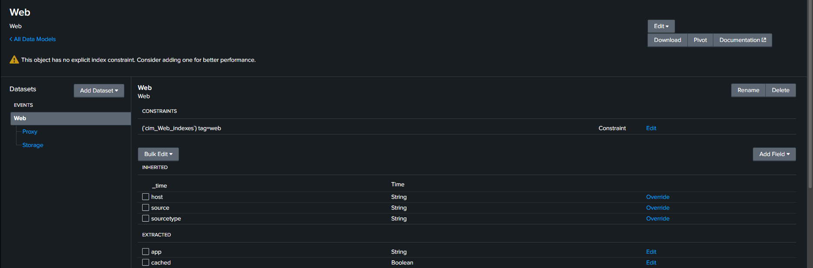  
2. Click Pivot on the top right  
3. Then click Web to search for the entire dataset

Create tags to map for datamodel:
Go to Event Types and create a new Event Type
1. Name the event type "Example_web1"
2. Set the search string to ```index=web host=web1```
3. Set the Tag as "web" since the Web datamodel already has that tag.
4. We can also change the colour to any colour you want. Then click Save  
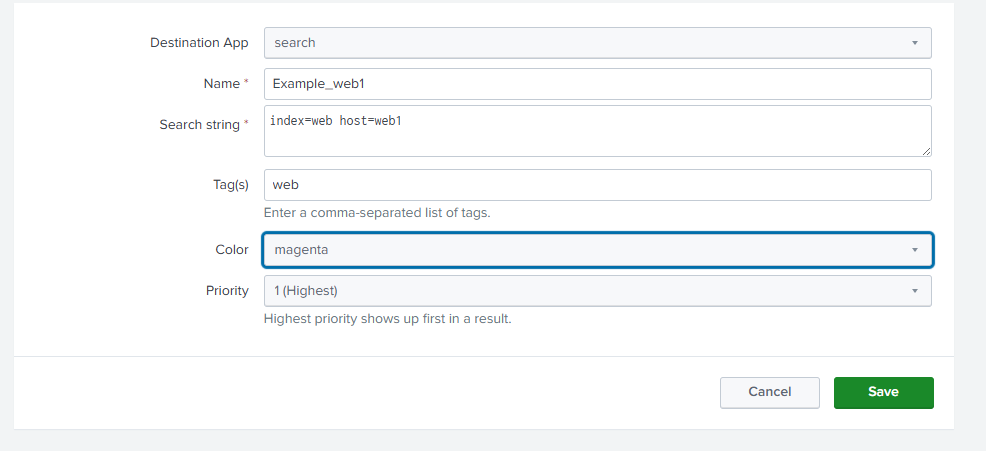  
5. Edit the permissions to be accessible by all     
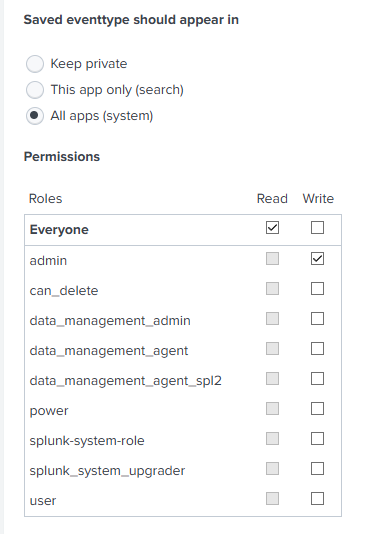  

To check that we've mapped the data to the datamodel we can run a search: ```| tstats count from datamodel=Web```  
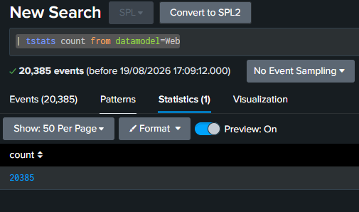  
We can also check the same in the Web datamodel Pivot.  
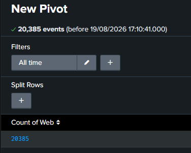  


Here is another way to map data with an add-on:

First, download the Splunk Add-On Builder.  
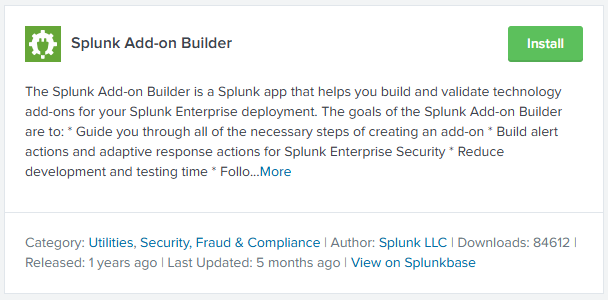  

Go to the newly installed app, either from Home or click on Apps > Splunk Add-on Builder  

1. Click New Add on on the right
  
1. Enter the name as "Example_Web2"
2. Click Create
3. Click Manage Source Types at the top  
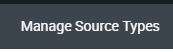  
4. Click Add > Import from Splunk  
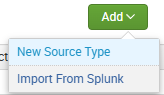  
1. Select Source Type as access_combined  
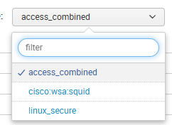  
1. Click Save

You can double check the total number of events are correct by searching sourcetype=access_combined in all indexes.  

1. Now that we have added the events, at the top click Map to Datamodels
2. Click New Data Model Mapping
3. Give it a name "Example_for_web2"
4. Set the sourcetype to access_combined
5. Add ```index=web``` to the search since that is the only index which uses that sourcetype  
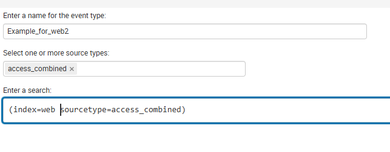  
1. Click Save  
Now we should be able to view all our field names from the web index with sourcetype access_combined:  
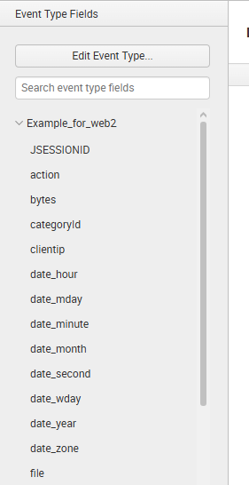  
1. Click Select Data Models on the right  
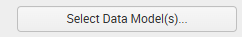  
1. Find Web, click the checkbox and click Select  
We can start creating Field Aliases by clicking New Knowledge Object > FIELDALIAS
1. Select clientip for Event Type Field or Expression, select crv for Data Model Field, then click OK    
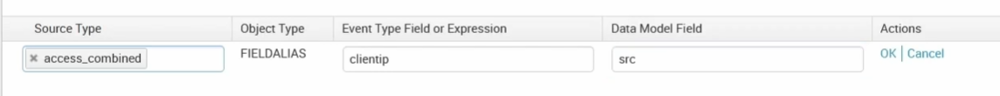  
1. Do the same for:
   1. useragent -> http_user_agent
   2. method -> http_method
   3. referer_domain -> http_referer_domain
   4. There are more you can do, but these are fine for an example
2. Click Done  
Now we can go back to search and run the count for the Web data model to see all the events are mapped.

You can go to Settings > All Configurations to see the TA we just built