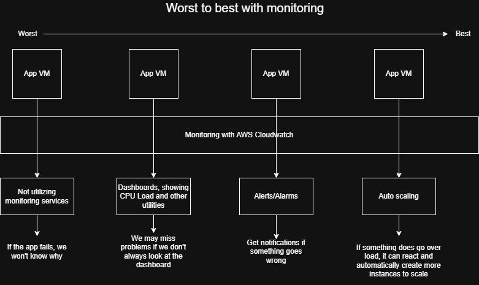
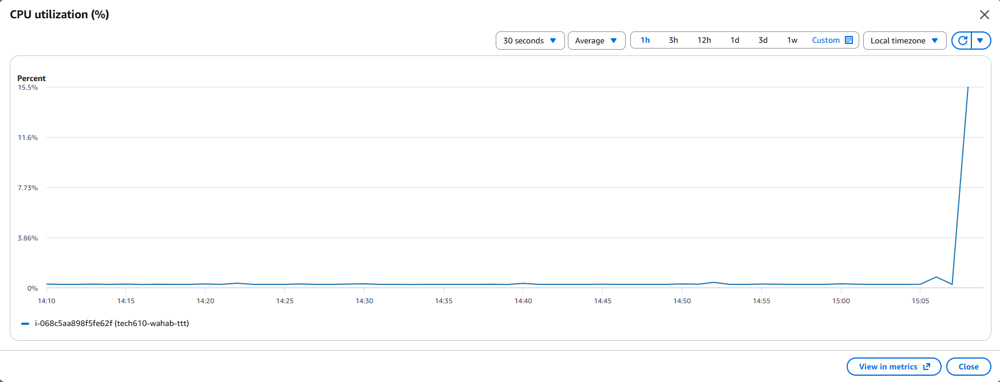
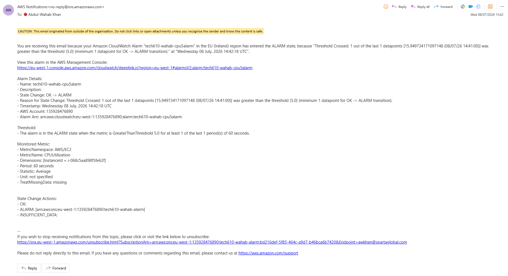

# Monitoring, alert management and auto scaling

## Performance Testing

What is performance testing?
* Performance testing is a type of non-functional testing that tells us how well our software/server is handling itself under workload.

Performance testing includes:
* Load testing
    * Can the app handle the usual amount of traffic?
* Stress testing
    * How much traffic can the app handle before it breaks?
    * What happens when it does eventually break?

What will we do?
* Use a tool called Apache Bench (ab) to perform load tests
* Take note of what happens to the CPU usage

## Apache Bench

### Installing Apache Bench

`sudo apt install apache2-utils -y` This command will install Apache Bench

### Doing the load testing
Format to do a load test
```
ab -n 1000 -c 100 http://yourwebsite.com/
```


Examples of commands to run:
```
ab -n 1000 -c 100 http://54.78.218.219/

ab -n 10000 -c 200 http://54.78.218.219/

ab -n 20000 -c 300 http://54.78.218.219/
```
* -n describes the number of requests being sent
* -c describes the concurrent number of requests being sent
* E.g. -n 1000 -c 100 means 1000 requests will be sent altogether, 100 at a time.

# Tasks

## Worst to best in terms of Monitoring


## How to setup a dashboard in AWS

1. Open your instance summary on AWS, scroll down and click on the Monitoring tab
2. Click the 3 dots on the right side of the monitoring page and click "Add to dashboard", which will open a new tab on your browser.
3. You will see a pop-up for you to either select an existing dashboard or create a new one. 
4. Since we are trying to create a new dashboard, click "Create New". Enter a dashboard name, click "Create" and then click "Add to dashboard".

You should now have a working dashboard for your EC2 instance.

The default setting on AWS is for your monitoring to update every 5 minutes.  
If you would rather it update every 1 minute you can:
1. Open your instance summary on AWS, scroll down and click on the Monitoring tab
2. Click on "Manage detailed monitoring"
3. A pop-up will appear where you can enable detailed monitoring by clicking the "Enable" checkbox. Once checked, click "Confirm"

Be aware, this will incur additional fees.

## Load testing & Dashboard

If we run Apache Bench on the VM, we can see the impact it has on our VM through the dashboard.


Above depicts the CPU utilisation widget on a dashboard. 

You can see a spike that reaches 15% after idling at below 1%. Just from looking at this graph we can tell that something happened on the application for the CPU usage to reach 15%.   
This spike was due to Apache Bench running 20000 requests at a concurrency of 400.  

## Alarms

In this section we will be creating an alarm that notifies you if your CPU usage reaches above 5% as an example.

1. To create an alarm that notifies you go to the [Alarms](https://eu-west-1.console.aws.amazon.com/cloudwatch/home?region=eu-west-1#alarmsV2:) section in Cloudwatch.

1. Click on "Create Alarm"

1. Make sure "Metrics" is chosen as the Data source, and "Classic" is chosen as the Type. Click on "Select metric".

1. Choose "EC2", then "Per-Instance Metrics". Here you will need to find your instance.

1. Click on the search bar and click on "InstanceID" then "InstanceID : ".  
Now paste your InstanceID which you will find in your instance summary page, then click enter.

1. It should now be filtering for your instance only. Now search for the Metric name "CPUUtilization" the same way we did with the InstanceId, or you can scroll to the bottom and find it.  
Once you have found it, select the checkbox and click "Select metric"

1. Next you can change the Period to 1 minute if you have enabled detailed monitoring.

1. Under conditions, make sure the Threshold type is "Static" and "Greater" has been chosen.

1. Beneath that we can choose what percentage the CPU usage should be higher than for the alarm to trigger. In our case, we will enter "5". Then click "Next".

1. Make sure "In alarm" under Alarm state trigger has been chosen. 

1. Click "Create new topic" under Send a notification to the following SNS topic. This will allow us to send a notification to ourselves once the alarm has been triggered.

1. Enter a topic name like "tech610-yourname-CPU-alarm"

1. Enter your email address under "Email endpoints that will receive the notification..." Then click "Create topic"

1. You will get an email from AWS which tells you, you are subscribing to the topic - the alarm you just created.  
You will need to confirm to be able to receive the notifications from the alarm.

1. Go back to AWS and click "Next"

1. Provide a name and you may provide a description too. The description allows markdown formatting (but it is only applied when viewing the alarm in the console, not when viewing the notification). Once completed, click "Next"

1. You can preview and edit previous configurations. Lastly, click "Create alarm".

Below is an example of a notification you may receive when the alarm triggers:


## Clean up

To delete your alarm:

1. Find your alarm in Cloudwatch > Alarms
1. Select your alarm
1. Click on "Actions"
1. Click on "Delete"
1. You will be prompted to click "Delete" again

To delete your dashboard:

1. Find your dashboard in Cloudwatch > Dashboard
1. Select your dashboard
1. Click on "Actions"
1. Click on "Delete"
1. You will be prompted to click "Delete" again

To delete your SNS topic:

1. Find your SNS Topic in Amazon SNS (Simple Notification Service) and select it
1. Click on "Delete"
1. You will be prompted to enter the phrase "delete me". Once completed, click "Delete"